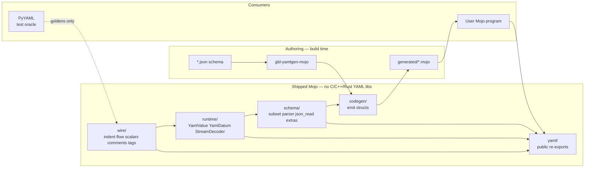

# YAML for Mojo (`mojo-yaml`)

| Field | Value |
| --- | --- |
| **Document title** | YAML 1.2 serializer for the Mojo programming language |
| **Author** | Leonid Ganeline |
| **Date** | 2026-09-10 |
| **Status** | Draft (rev 3) |
| **Target repo** | `/home/leo/PycharmProjects/GLD/gld-yaml` (greenfield standalone library; only a local `.env` as of 2026-09-10) |
| **License** | MIT, Copyright (c) 2026 Leonid Ganeline |
| **Recommended Mojo pin** | `mojo == 1.0.0` (stable, 2026-08-11) |
| **Spec target** | [YAML 1.2.2](https://yaml.org/spec/1.2.2/) **Core schema** tags (`tag:yaml.org,2002:` null / bool / int / float / str / seq / map). `!!binary` is a v1 type-repository extra, not a Core tag. |
| **Docs** | <https://leo-gan.github.io/gld-yaml/> |
| **Publish channel** | <https://prefix.dev/leo-gan/leo-gan> |

---

## Overview

There is no from-scratch, schema-driven YAML library for Modular Mojo as of 2026-09-10. This document specifies a **standalone, from-scratch Mojo** YAML library for the empty `gld-yaml` repository: independently buildable layers (`wire`, `runtime`, `schema`) plus a `yaml` facade, a Mojo CLI that reads a JSON Schema subset in-process, generated structs with explicit `encoded_len` / `encode_to` / `decode_from`, and a dynamic `YamlValue` tree that can encode and decode any well-formed YAML 1.2 Core-schema document without a schema.

**Hard product constraint:** the shipped runtime and the codegen walker have **zero C, C++, or Rust YAML library dependencies**. They do not wrap, link, FFI, bind, or vendor libyaml, libfyaml, RapidYAML/ryml, yaml-cpp, serde_yaml, unsafe-libyaml, PyYAML’s C extension, goccy/go-yaml, js-yaml, or EmberJson. Python `yaml` (PyYAML) is a **test oracle only**. SIMD is allowed only as Mojo `SIMD` types.

v1 implements the **closed grammar** in “What v1 implements”: block and flow collections, the five scalar styles (including multiline plains and the full folded `>` rule), explicit `?` keys, comments skipped on decode, document markers and multi-document streams, Core implicit types on plain scalars, explicit Core tags, the non-specific `!` tag, the extra `!!binary` tag, and anchors/aliases on decode. That set is every production needed to decode a well-formed Core-schema document plus `!!binary`. Default encode is block style, two-space indent, no comments, no anchors (values are expanded). The timed path is the **generated** path. YAML 1.1 implicit typing is out of v1, so `yes` / `no` / `on` / `off` / `NO` stay strings.

The first test records (`Message`, `Document`, `Telemetry`, `Strings`, `Event`, `Batch_*`, `LongList`, mutual `A`/`B`) live under this repo’s `testdata/` as ordinary unit and interop test material. They are not the product schema and they are not a dependency on any other repository.

This library does **not** depend on `mojo-json` or any other sibling conda package. The schema parser reads JSON Schema files with a small in-repo JSON reader at `src/schema/json_read.mojo`, copied from the contract in `/home/leo/PycharmProjects/GLD/gld-messagepack/src/schema/json_read.mojo`. That reader only needs objects, arrays, strings, numbers, bools, and null.

---

## Background & Motivation

### Why this change is needed

Mojo 1.0 shipped on 2026-08-11 with source stability and ownership. A Mojo program that speaks YAML today would have to wrap CPython PyYAML or link libyaml / yaml-cpp. That measures someone else's runtime, fights Mojo ownership on every `String` / `List` crossing, and violates the no-native-library rule. This repo is a reusable Mojo codec and codegen tool.

The sibling libraries `gld-messagepack`, `gld-json`, `gld-cbor`, and `gld-protobuf` proved the product shape: pixi + Mojo 1.0, layered packages, generated structs, Python oracle goldens, MkDocs Pages, conda on prefix.dev. YAML is a different format. The text is indentation-sensitive, collections have block and flow styles, scalars have five presentations, and the implicit type system is a schema (Core), not a first byte. The schema language in this product is the same JSON Schema subset used by `gld-messagepack` / `gld-json`, plus a closed list of YAML extras. The product packaging is the same.

YAML is the closest **text** sibling to `gld-json` (`src/wire/simdscan.mojo`, `stage1.mojo`, `string.mojo`, `number.mojo`, pretty writer). It is the closest **product** sibling to `gld-messagepack` (JSON Schema + extras, `json_read.mojo`, `StreamDecoder`, docs nav with Techniques). This design copies both.

### Current state of the repo

- `/home/leo/PycharmProjects/GLD/gld-yaml` is an empty directory except a local `.env` that holds `PREFIX_API_KEY`. It is not a git repository.
- `leo-gan/gld-yaml` does not exist on GitHub yet.
- No Modular-Mojo YAML package is assumed to exist. This document does not treat the absence as a hard negative proof.

### Pain points this library must not inherit

- A stub that only knows the five v2 test records.
- Any linked C/C++/Rust YAML implementation, including an optional libyaml FFI path.
- A reflection-only encoder: Mojo reflection sees Mojo fields, not YAML indent, Core implicit types, or schema `required`.
- Coupling the library to `seriailizer-benchmark` (the sibling folder name is spelled that way) or any other monorepo.
- Implementing YAML 1.1 implicit typing and then claiming Core (`yes` → bool, the “Norway problem” `NO` → bool).
- Mutating the caller’s `Span[Byte]` (ryml in-situ). v1 copies into owned strings / arena text.
- Committing `.env` or `temp/`.

---

## Goals & Non-Goals

### Goals (v1 product)

1. **100% from-scratch Mojo** encode/decode of the closed YAML 1.2 Core-schema grammar in “What v1 implements”, plus multi-document streams.
2. Independently buildable layers: `wire/`, `runtime/`, `schema/`, plus `yaml/` facade. Codegen is a CLI, not a runtime import.
3. Parse the locked JSON Schema subset in Mojo, using an in-repo JSON reader. No host JSON Schema compiler. No dependency on `mojo-json`.
4. CLI `gld-yamlgen-mojo` emits typed Mojo structs with explicit `encoded_len` / `encode_to` / `decode_from`.
5. Dynamic `YamlValue` (arena of nodes) for schema-free encode/decode of any document in that closed grammar.
6. `StreamDecoder` plus `decode_all` / `encode_all` for `---` / `...` multi-document streams.
7. Optional members are `Optional[T]`. Missing keys and YAML `null` both become `None`. Two-branch `null` unions are `Optional[T]`. Other unions of named objects are tagged Mojo structs whose YAML encoding is the selected branch mapping with no wrapper.
8. Interop on known **Core-schema-safe** data with PyYAML `yaml.safe_dump` / `yaml.safe_load` / `safe_load_all`.
9. Decoder walks a `Span[Byte]`. Encoder writes into a `List[Byte]` pre-sized from `encoded_len` when the size is known. Owned `String` / `List[Byte]` on decode. The caller buffer is never mutated.
10. Typed `DecodeError` with `kind: Int`, `offset: Int`, and `field: Int` (`0` means unknown).
11. Independently useful library. Not coupled to any other project.
12. Recursive named types in generated code: detect cycles on the named-type graph with strongly connected components. Emit heap `Box` for any field whose type (after unwrapping optional / array) is in the current type’s SCC. Testdata includes `LongList` and mutual `A`/`B`. Non-optional recursive fields are a codegen error.
13. Default write is block style, two-space indent, unquoted keys when Core-safe, shortest plain scalars when Core-safe, double quotes otherwise. `EncodeOptions` may request flow style.

### Non-goals (v1)

- YAML 1.1 implicit typing (`yes` / `no` / `on` / `off` / `y` / `n`, sexagesimal, `NO` as bool).
- Custom / global tags beyond the Core set plus the v1 extra `!!binary`.
- `%YAML` / `%TAG` directives beyond accepting and ignoring `%YAML 1.2`. **Every** `%TAG` is `KIND_TAG`, including a no-op that restates Core (`%TAG ! tag:yaml.org,2002:`).
- Merge key `<<`.
- Comment round-trip and identity encode (preserve original style, anchors, comments).
- Full JSON Schema 2020-12 vocabulary.
- GPU parse.
- C/C++/Rust YAML libraries, even as an optional path.
- Reflection-driven encode of arbitrary non-generated Mojo structs.
- A `seriailizer-benchmark` client in this repository.
- A dependency on `mojo-json` or any other sibling conda package at build or runtime.

### Later (explicitly planned, not v1)

- Merge key `<<`.
- Comment round-trip and identity encode (keep scalar style, anchors, and comments on `YamlValue`).
- A larger JSON Schema vocabulary (`minimum` / `maximum` / `minLength` / `maxLength` / `minItems` / `pattern` / `additionalProperties`).
- Zero-copy `StringSpan` views on unescaped plain / literal scalars that the caller promises to keep alive.
- `DecodeOptions.inplace` that may overwrite the caller buffer (ryml-style). Default stays copy-out.
- Remote `$ref` from a local file catalog (still no network).

---

## Proposed Design

### Product naming

| Surface | Name | Rationale |
| --- | --- | --- |
| Git repository | `gld-yaml` | Directory already created; GitHub repo `leo-gan/gld-yaml` to create. |
| Public Mojo import | `yaml` | What generated code and apps write (`from yaml import …`). |
| Conda / pixi package | `mojo-yaml` | Avoids colliding with conda-forge / PyPI `yaml` / `pyyaml`. |
| Codegen CLI | `gld-yamlgen-mojo` | Matches `gld-msgpackgen-mojo` / `gld-jsongen-mojo`. |
| Trait | `YamlDatum` | Generated test type `Message` keeps the name `Message`. |
| Dynamic tree | `YamlValue` | Schema-free arena. |
| Docs site | <https://leo-gan.github.io/gld-yaml/> | GitHub Pages. |

### Packaging bootstrap (locked)

| Fact | Value |
| --- | --- |
| Initial `pixi.toml` version | `0.1.0`. Intermediate PRs do not bump it. One bump `0.1.0` → `0.2.0` + prefix.dev publish after PRs 1–14 are on `main`. |
| Channels | `https://conda.modular.com/max` and `conda-forge`. |
| Platforms | `["linux-64"]`. |
| Mojo pin | `mojo == 1.0.0` in pixi; recipe build pin `mojo-compiler == 1.0.0`. |
| pixi tasks | `test`, `golden`, `generate`, `precompile`, `check-generated` (same five names as `/home/leo/PycharmProjects/GLD/gld-messagepack/pixi.toml`). Feature `bench` (PR 14) adds task `microbench = "bash scripts/run-microbench.sh"`. Feature `oracle` has `python` + `pyyaml`. |
| `from yaml import …` | Development: `mojo -I src`. Installed package: `$PREFIX/lib/mojo/yaml.mojoc` plus the other published `.mojoc` files. Generated code imports only the `yaml` facade. |
| Oracle extra | pixi feature `oracle` with `python` and `pyyaml` for `scripts/gen_golden.py`. Not a runtime dependency. |
| Recipe about | homepage `https://leo-gan.github.io/gld-yaml/`; repository `https://github.com/leo-gan/gld-yaml`; license MIT; test via `conda.recipe/test_import.mojo`. |
| Secrets | `.env` and `temp/` are gitignored. `PREFIX_API_KEY` is a GitHub Actions secret and a local file. It is never committed. |
| Publish channel | `https://prefix.dev/leo-gan/leo-gan`. Automatic publish on GitHub Release (`publish.yml`). |

**Precompile order** (`scripts/precompile.sh`). The graph is acyclic: `schema` uses `DecodeError` and may validate a `YamlValue`, so it depends on `runtime`. `runtime` does **not** import `schema`. Generated types never parse a schema at runtime.

1. `wire.mojoc` (no in-repo deps)
2. `runtime.mojoc` (needs `wire`)
3. `schema.mojoc` (needs `runtime`; includes `json_read`)
4. `yaml.mojoc` (needs all of the above)

The CLI is a separate `mojo build` of `src/codegen/cli.mojo` → `gld-yamlgen-mojo`.

### Four-plus-one layer architecture

```text
gld-yaml/
├── src/wire/      # YAML 1.2 scanner / reader / writer (indent, flow, scalars, comments)
├── src/runtime/   # YamlValue, YamlDatum, stream/multi-doc, options, Box
├── src/schema/    # JSON Schema subset + YAML extras; json_read.mojo
├── src/codegen/   # gld-yamlgen-mojo
└── src/yaml/      # public facade
```



### Repository layout

Mirror `/home/leo/PycharmProjects/GLD/gld-messagepack/DESIGN.md` “Repository layout”, adapted for a text format (golden `.yaml` + `.hex`, PyYAML oracle).

```text
gld-yaml/
  pixi.toml                      # mojo==1.0.0; optional python+pyyaml for oracle only
  pixi.lock
  LICENSE                        # MIT, Copyright (c) 2026 Leonid Ganeline
  README.md
  DESIGN.md                      # this document, committed in PR 1
  .gitignore                     # includes .env and temp/
  src/
    wire/
      __init__.mojo
      reader.mojo                # WireReader over Span[Byte]; indent stack
      writer.mojo                # WireWriter into List[Byte]; cursor pos
      scalar.mojo                # plain / quoted / block scalar parse and emit
      number.mojo                # Core int / float; reuse gld-json digit ideas
      comment.mojo               # # to end of line; SIMD skip
      indent.mojo                # indent stack (reserved List, not per-level heap)
      flow.mojo                  # { } [ ] flow collections
      tag.mojo                   # !!null !!bool !!int !!float !!str !!seq !!map !!binary
      anchor.mojo                # &name / *name table
      simdscan.mojo              # SWAR/SIMD for \n : , # quotes (from gld-json)
      utf8.mojo                  # String(from_utf8=) → DecodeError remap
      base64.mojo                # !!binary
    runtime/
      __init__.mojo
      error.mojo                 # DecodeError
      options.mojo               # EncodeOptions / DecodeOptions
      value.mojo                 # YamlValue arena
      datum.mojo                 # trait YamlDatum + encode/decode
      box.mojo                   # heap Box[T]
      stream.mojo                # StreamDecoder, encode_all / decode_all
    schema/
      __init__.mojo
      json_read.mojo             # tiny JSON reader (object/array/string/number/bool/null)
      model.mojo                 # SchemaDoc / SchemaType / SchemaProp
      parse.mojo                 # ReadValue → SchemaDoc
      validate.mojo              # instance check on YamlValue
      scc.mojo                   # named-type SCC for Box
    codegen/
      __init__.mojo
      names.mojo                 # reserved-name table (copy gld-messagepack)
      emit.mojo                  # walk model → Mojo source
      cli.mojo                   # gld-yamlgen-mojo main()
    yaml/
      __init__.mojo              # public re-exports
  testdata/
    schema/                      # JSON Schema documents for tests and codegen
    golden/                      # oracle .yaml + .hex from scripts/gen_golden.py
      README.md                  # which files the script owns vs literal fail text
    stream/                      # multi-document samples
  tests/
    test_*.mojo
    generated/                   # committed output of gld-yamlgen-mojo
    manual_types.mojo
  tests_interop/
    encode_ref.py
    decode_ref.py
    encode_mojo.mojo
    interop.sh
  examples/
    encode_value.mojo
  benches/
    microbench.mojo              # local n=1 and n=100
  scripts/
    run-tests.sh
    generate.sh
    check-generated.sh
    precompile.sh
    ci-setup.sh
    gen_golden.py
    run-microbench.sh
  conda.recipe/
    recipe.yaml
    test_import.mojo
  docs/
    index.md
    why-yaml.md
    instructions.md
    examples.md
    techniques.md
    test-data.md
  mkdocs.yml
  requirements-docs.txt
  .github/workflows/
    ci.yml
    pages.yml
    publish.yml
```

`temp/` is not listed. It is gitignored scratch.

### How `from yaml import` resolves

| Context | Mechanism |
| --- | --- |
| In-repo tests / examples | `mojo run -I src …`. pixi task: `test = "bash scripts/run-tests.sh"`. |
| Generated code | `from yaml import YamlDatum, WireWriter, WireReader, DecodeError` — requires `-I src` (or `MOJOPATH` including `src`). |
| Downstream git checkout | Document `mojo -I path/to/gld-yaml/src`. |
| After `mojo precompile` / conda | `yaml.mojoc` installed to `$PREFIX/lib/mojo/`; the compiler auto-discovers it. |

`src/yaml/__init__.mojo` re-exports the public surface. It does **not** re-export `schema` parse internals or `codegen`. `json_read` is never on the facade.

---

## Mojo 1.0 constraints

These were learned on `gld-cbor` / `gld-json` / `gld-protobuf` / `gld-messagepack`. Implementers must not rediscover them. The table is copied from `/home/leo/PycharmProjects/GLD/gld-messagepack/DESIGN.md`.

| Topic | What is true in 1.0 | Design consequence |
| --- | --- | --- |
| Functions | Use `def`, not `fn`, in this family’s code. | All snippets in this document use `def`. |
| Tuples | Written `Tuple[T]`, not `(T,)`. | `read` helpers return `Tuple[Int, UInt64]`. |
| Origins | Documented name is `ImmOrigin`. Use `Self.origin`. | `WireReader[origin: ImmOrigin]`. |
| Inits | No `@fieldwise_init` together with a custom `__init__`. | Codegen emits an explicit zero-arg `__init__` and a fieldwise overload. |
| `List` | Not `ImplicitlyCopyable`. No `List[T](a, b)` in some builds. | `append`. Transfer with `append(item^)`. |
| SIMD | `to_bits()` needs `UInt64(...)`. Shifts need a same-width RHS. | Scan masks are `UInt64`. Reuse `pack_bits` / `count_trailing_zeros` from `gld-json/src/wire/simdscan.mojo`. Do **not** copy `skip_ws_span` as-is: that helper skips tab/space/LF/CR unconditionally and would treat a tab indent as whitespace and erase the indent run. |
| Strings | `String[i]` is a UTF-8 span. Use `as_bytes()` / `[byte=]`. | Key compare is byte-wise. |
| Traits | Decode traits need `Deinitable`. | `YamlDatum(Copyable, Movable, Defaultable, Deinitable)`. |
| Keywords | `var` / `match` / `fn` / `struct` clash. | Rename to `struct_`, `fn_`, `var_`. |
| Recursion | Recursive `List[MessageDesc]` may not be `Deinitable`. | Flatten schema members into a side table. `YamlValue` is an arena. `Box[T]` is a one-element `List`. |
| Inits | Explicit inits only. | No defaulted fieldwise synthesis. |

`Box[T]` is re-exported from `yaml`. Implementation matches `/home/leo/PycharmProjects/GLD/gld-messagepack/src/runtime/box.mojo`: a one-element `List[T]` (a raw `Pointer` cell double-frees on copy in Mojo 1.0). API: `__init__(var value: T)` and `__getitem__` returning a copy of `T`.

---

## Wire format (YAML 1.2 Core)

YAML text is a stream of one or more documents. A decoder does not need a schema to walk a value. The production this library implements is the YAML 1.2 **Core schema**, not YAML 1.1, and not the Failsafe schema alone.

Encoding is UTF-8 only. A UTF-8 BOM (`EF BB BF`) is accepted **only** at the start of the stream and is skipped. A BOM anywhere else is `KIND_UTF8`. Line endings on decode are CR (`0x0D`), LF (`0x0A`), or CRLF (YAML 1.2 §5.4). Encode writes `LF` only. A lone CR is one line break.

Tabs (`0x09`) in **indentation** are `KIND_INDENT`. Tabs inside quoted scalars, after content on a line, or inside block-scalar content are data, not indent.

### What v1 implements

This table is the **closed grammar**. Goal 1 and Goal 5 mean this set, not the rest of YAML 1.2 (no custom tags, no `%TAG`, no merge key, no 1.1 implicit typing).

| Feature | Rule |
| --- | --- |
| Block mappings | Indent-sensitive `key: value`. A nested **mapping** value starts on the next line at indent+2 (`meta:`). A nested **sequence** value writes `-` at the **key’s** indent (`items:` / `tags:`). Compact seq-of-map is `- sku: a` then `qty` aligned with `sku` (not with `-`). |
| Block sequences | `- ` items at the sequence indent (the column of `-`). After a mapping key that is the parent, that column equals the key’s indent, not key+2. |
| Flow mappings | `{key: value, …}` JSON-like, nested in block or flow. |
| Flow sequences | `[item, …]`. |
| Explicit `?` keys | `?` then any node as the key, then `:` at the same indent and the value. Empty key (`?` with an empty node, or a block line that is only `:`) is a `YK_STRING` of length 0. Complex keys (seq / map) are stored on `YamlValue` and skipped as unknown on generated `decode_from`. |
| Plain scalars | Unquoted. Single-line and **multiline** (`[135] ns-plain-multi-line`, Example 7.12). Continuation folds with `s-flow-folded`, not block `>`. Resolved with the Core implicit table below. |
| Single-quoted | `'` with `''` as an escaped quote. No other escapes. |
| Double-quoted | YAML 1.2 `c-ns-esc-char` (table below). |
| Literal `\|` | Keep newlines. Chomping `+` / `-` and indent indicator. |
| Folded `>` | YAML 1.2 §8.1.3: equally-indented non-empty lines fold (newline → space); a blank line is a newline; **more-indented** lines are not folded and the breaks around them are kept (Example 8.11). Same chomping / indent. |
| Comments | `#` to end of line, when `#` is not inside a quoted or block scalar and, in a plain scalar, is preceded by whitespace. Skipped on decode. Default encode does not emit comments. |
| Line breaks | CR, LF, CRLF on decode. Encode writes LF. |
| Document markers | `---` starts a document. `...` ends one. |
| Multi-document | `decode_all` / `encode_all` / `StreamDecoder`. |
| Core implicit types | Table below. **Not** YAML 1.1. |
| Explicit Core tags | `!!null` `!!bool` `!!int` `!!float` `!!str` `!!seq` `!!map`. |
| Non-specific `!` | Core §10.3.2: `!` on a seq is `!!seq`, on a map is `!!map`, on a scalar is `!!str` (so `! true` is a string). |
| `!!binary` (v1 extra) | Not a Core tag. `tag:yaml.org,2002:binary`. Base64 (RFC 4648, padding required on encode) → `List[Byte]`. Decode accepts interior whitespace in the base64. |
| Anchors / aliases | `&name` / `*name` on decode. Table lives on `WireReader`. Default encode expands. `DecodeOptions.keep_anchors` stores the name on `YamlValue.anchors`. |
| Merge key `<<` | **Not** merged. The key `<<` is an ordinary string key. |
| Directives | `%YAML 1.2` accepted and ignored. Any other `%YAML` version is `KIND_SYNTAX`. **Every** `%TAG` is `KIND_TAG`. |

### Core-schema implicit types (plain scalars only)

Quoted scalars, block scalars, and explicitly tagged nodes do **not** go through this table. A double-quoted `"true"` is a string.

| Production (YAML 1.2 Core) | Kind | Notes |
| --- | --- | --- |
| empty, `~`, `null`, `Null`, `NULL` | `YK_NULL` | Empty plain is null only when the grammar allows an empty node (for example a key with no value). |
| `true`, `True`, `TRUE` | `YK_TRUE` | |
| `false`, `False`, `FALSE` | `YK_FALSE` | |
| `[-+]?[0-9]+` | `YK_INT` | Decimal. Leading zeros are still an integer (`01` is 1). |
| `0o[0-7]+` | `YK_INT` | Octal. |
| `0x[0-9a-fA-F]+` | `YK_INT` | Hex. |
| `[-+]?(\.[0-9]+\|[0-9]+(\.[0-9]*)?)([eE][-+]?[0-9]+)?` | `YK_FLOAT` | |
| `[-+]?(\.inf\|\.Inf\|\.INF)` | `YK_FLOAT` | ±infinity. |
| `\.nan\|\.NaN\|\.NAN` | `YK_FLOAT` | NaN. |

**Not recognized** (stay `YK_STRING`):

| Token | Why |
| --- | --- |
| `yes`, `no`, `on`, `off`, `y`, `n`, `Yes`, `NO`, … | YAML 1.1 bools. `NO` as a country code must stay a string (Norway problem). |
| `0:00`, sexagesimal | YAML 1.1. |
| `Null` is null; `nul` is a string | Exact Core spellings only. |

Integer values that fit `Int64` become `YK_INT`. An integer production whose magnitude does not fit `Int64` is parsed as `Float64` if finite, else `KIND_RANGE`. This matches the gld-json number policy in `/home/leo/PycharmProjects/GLD/gld-json/DESIGN.md`. `-0` as an integer production is `YK_INT` zero. `-0.0` is `YK_FLOAT` negative zero.

### Double-quoted escapes (YAML 1.2 `c-ns-esc-char`)

| Escape | Meaning |
| --- | --- |
| `\0` `\a` `\b` `\t` `\n` `\v` `\f` `\r` `\e` | U+0000, U+0007, U+0008, U+0009, U+000A, U+000B, U+000C, U+000D, U+001B |
| `\ ` `\"` `\/` `\\` | space, quote, slash, backslash |
| `\N` `\_` `\L` `\P` | U+0085, U+00A0, U+2028, U+2029 |
| `\xXX` `\uXXXX` `\UXXXXXXXX` | 8 / 16 / 32-bit hex code point. Must be a valid Unicode scalar (no lone surrogates). |
| any other `\x` | `KIND_ESCAPE` |

Unescaped `/` is legal. Encode of a string that needs quoting uses double quotes. Encode of `/` does not write `\/`.

`string_from_utf8` catches the default `Error` from `String(from_utf8=)` and raises `DecodeError(KIND_UTF8, offset)`. Never `unsafe_from_utf8`. Never lossy.

### Block scalars

A block scalar starts with `|` or `>` plus an optional chomp indicator (`+` / `-`) and an optional indent indicator (`1`–`9`), in either order.

| Chomp | Decode | Encode (default) |
| --- | --- | --- |
| clip (no mark) | Keep one trailing newline; drop extras | clip |
| strip `-` | Drop every trailing newline | not default |
| keep `+` | Keep every trailing newline | not default |

The indent indicator is the **content** indent relative to the parent. If omitted, the indent is the indent of the first non-empty content line. A content line indented less than that is `KIND_INDENT`.

Folded `>` follows YAML 1.2 §8.1.3 / Example 8.11, not “replace every newline with a space”:

| Line after a break | Result |
| --- | --- |
| Next non-empty line at the **same** content indent | The break becomes one space (fold). |
| A blank line (only indent spaces) | The break becomes a newline. |
| Next non-empty line at a **greater** indent | The break is **kept** as a newline and that line is not folded. Breaks around a more-indented run are kept. |

Default encode never writes `|` or `>` unless the string contains a newline **or** `x-yaml-style` / a later identity mode asks for it. A string with a newline is written as a clipped literal `|` so the payload is exact. A string without a newline uses plain or double-quoted.

#### Multiline plain scalars

A plain scalar continues onto the next line when that line’s indent is **strictly greater** than the parent collection indent (the indent that would start a sibling key or `-` item) and the line is not a comment. This is YAML 1.2 `[135] ns-plain-multi-line` / Example 7.12.

Folding is **`s-flow-folded`** (`[134]` → `[74]`, spec §6.5), **not** block `>` folding (§8.1.3). In flow folding:

| Line after a break | Result |
| --- | --- |
| A blank line (only indent spaces) | The break becomes a newline. |
| Any other continuation (same indent or more-indented) | The break becomes one space. Leading white space on the continuation line is discarded. More-indent is presentation only and does **not** keep the break. |

Example 7.12 folds the more-indented third line into the second with a space (`"1st non-empty\n2nd non-empty 3rd non-empty"`). An implementer must not apply the `>` “more-indented lines keep their breaks” rule here. That rule stays on block folded scalars only.

A line that is only `# …` at that indent ends the plain (comment). A `- ` at the **parent** indent is a sibling sequence item, not a continuation.

Core implicit resolution runs on the **folded** text (spaces, not the raw line-breaks). `true` split across lines is still a bool.

### Default encode (locked)

Default `encode(...)` is **block style**, indent **2**, no document markers, no comments, no anchors.

| Value | Written form |
| --- | --- |
| null | `null` (not `~`, not empty) |
| bool | `true` / `false` (lowercase) |
| int | decimal, no leading zeros except `0`, optional leading `-` |
| finite float | see “Float digits” below |
| ±Inf | `.inf` / `-.inf` |
| NaN | `.nan` |
| string, Core-plain-safe in the **current** context | plain (no quotes) |
| string, otherwise, no newline | double-quoted |
| string with newline | clipped literal `\|` |
| empty mapping | `{}` |
| empty sequence | `[]` |
| non-empty mapping | block, schema / arena pair order, `key: value` on one line when the value is a scalar |
| nested **mapping** after a key | next line at **key indent + 2** (`meta:` then `  region:`) |
| nested **sequence** after a key | next line, `-` at the **key’s** indent (`items:` then `- sku:`). Do **not** add +2 before `-`. Same for `tags:`, `Strings.items`, `Event.attrs`. |
| non-empty sequence of scalars / seqs | block, `- ` then the item on the same line |
| non-empty sequence of mappings | **compact** `- key:` (PyYAML `safe_dump` default). First key shares the `- ` line; further keys align with that first key, not with `-`. |
| `List[Byte]` / `!!binary` | `!!binary` plus single-line padded base64 |

Normative block layout for one `Document` (indent 2). This is what `encoded_len_at` must count:

```text
id: x
status: 1
meta:
  region: us
  version: 1
items:
- sku: a
  qty: 1
  price_minor: 2
```

Two indent facts this example locks:

1. Nested **mapping** `meta` is at column 2 (key indent + 2).
2. Nested **sequence** `items` writes `-` at column 0 (the `items:` key’s indent), not at column 2.

Bytes that differ from a “`-` then nested mapping on the next line” form: there is no extra LF after `-`, and `sku` sits two spaces to the right of `-`, so `qty` / `price_minor` are at column 2, not column 4.

#### Core-plain-safe (context-sensitive)

A helper `is_plain_safe(s, flow: Bool)` is used by encode. Block and flow **cannot** share one predicate (YAML 1.2 `[126] ns-plain-first` / `[129] ns-plain-safe-in`).

Common rules (both contexts):

1. `s` is not empty.
2. `s` does not match any Core implicit production (so `true`, `01`, `.nan`, `0x10` are quoted).
3. `s` has no leading or trailing ASCII whitespace and no newline.
4. `s` does not contain `: ` (colon + space) or ` #`.

First character, YAML 1.2 `[126]`:

- Any `ns-char` that is not a `c-indicator` is allowed.
- A leading `-`, `?`, or `:` is allowed **only** when the next character is a non-space `ns-char` (`-foo`, `?foo`, `:foo`). A leading `-` followed by space is a sequence entry, not a plain.
- Other indicators (`#` `&` `*` `!` `|` `>` `'` `"` `%` `@` `` ` `` `[` `]` `{` `}` `,`) are never a legal first character.

Flow context only (`EncodeOptions.style = FLOW`, or a string written inside `{…}` / `[…]`):

5. `s` must not contain a flow indicator `[` `]` `{` `}` `,` **anywhere**. `[a,b]` as one string is double-quoted. The same string in block context may be plain.

#### Float digits

Copy the gld-json plan, substituting `yaml.safe_load` for `json.loads`. There is no Ryu/C and no claim that a Ryu port exists.

1. Non-finite: write `.inf` / `-.inf` / `.nan`. Do not raise.
2. Signed zero: `-0.0`.
3. Integer-valued finite with `|x| < 1e15`: the integer writer plus `.0`.
4. Else use Mojo `String(v)` if a golden `yaml.safe_load` recovers the same `Float64` bits.
5. If that fails a golden, implement a small scientific-format writer (sign, digits, `e`) in a one-hour box on the speed PR.

#### Document terminator

`encode_to` never writes a document marker and does not add a document-level LF beyond the `\n` that ends each block pair.

Public `encode` / `encode_value` / `encode_into` / `encode_all` then ensure the document ends with **exactly one** `LF`: if the last byte is already `0x0A`, they add nothing; otherwise they append one `LF`. Pre-size is `encoded_len + 1` so that extra byte always fits. Generated `encoded_len` / `encoded_len_at` count only the `encode_to` body.

Owned atom goldens are therefore `true\n`, `false\n`, `null\n`, `0\n`, and `hi\n` (plain `hi` plus the document LF). A block mapping golden ends with the last pair’s `\n` and no second `\n`.

Single-document `encode` / `encode_value` does **not** write `---` or `...`. `encode_all` of two or more documents writes `---\n` before every document after the first. `encode_all` of one document is the same as `encode`.

`EncodeOptions.style = FLOW` writes `{k: v, …}` and `[a, b]` with one space after `:` and `,`. Nested generated types honor a per-type `x-yaml-style` unless the options override is `FLOW` or `BLOCK` (not `DEFAULT`).

### Indent stack

The reader keeps an indent stack as a `List[Int]` **reserved to `max_depth`** at construction. Push and pop are index updates. There is no heap allocation per nesting level. This is the ryml idea that matters for YAML, expressed with the Mojo 1.0 `List` we already use.

A new block collection’s indent must be strictly greater than its parent. A sibling must match. A dedent pops until the stack top matches. Tabs in the indent run are `KIND_INDENT` before any comparison.

```mojo
struct IndentStack(Movable):
    var levels: List[Int]   # reserved to max_depth
    var len: Int

    def __init__(out self, *, max_depth: Int = 100):
        self.levels = List[Int]()
        var i = 0
        while i < max_depth:
            self.levels.append(0)
            i += 1
        self.len = 0
```

`len` is the live count. `levels[0]` is the root indent (usually 0).

Start-of-line spaces are **indent**, not whitespace to discard. YAML 1.2 §6.1 `s-separate-in-line` is spaces/tabs **after** content on the same line. §6.2 `s-indent` is the leading spaces of a new line. `skip_separation` implements §6.1 plus comments and blank lines. It does **not** consume the indent run of the next content line. `gld-json` `skip_ws_span` is not this function.

### Collection-iteration API (frozen for codegen)

Generated `decode_from` does not call `eat('{')`. YAML block mappings have no braces. The reader exposes this small iteration surface. Every generated mapping and sequence uses it.

```mojo
comptime CTX_BLOCK = 0
comptime CTX_FLOW = 1

struct MapState(Copyable, ImplicitlyCopyable):
    var ctx: Int      # CTX_BLOCK or CTX_FLOW
    var indent: Int   # block: column of this mapping's keys; flow: unused

struct SeqState(Copyable, ImplicitlyCopyable):
    var ctx: Int
    var indent: Int   # block: column of `-`

def skip_separation(mut self) raises DecodeError
    # Comments, blank lines, and in-line spaces/tabs after content (§6.1).
    # Does not consume start-of-line indent spaces. A tab in an indent run
    # that skip_separation is *not* reading is left for line_indent.

def line_indent(self) -> Int
    # Space count from the last line-break to the first non-space on this
    # line. If pos is still in that run, count includes only the spaces
    # already seen plus those remaining before content. A tab in the run
    # is KIND_INDENT (raised by the caller that measures, typically
    # begin_map / next_key / next_item).

def at_dedent(self) raises DecodeError -> Bool
    # After skip_separation: EOF, `...`, `---`, or next content column
    # strictly less than the current collection indent.

def at_document_end(self) raises DecodeError -> Bool
    # After skip_separation: EOF or `---` / `...` at column 0.

def consume_props(mut self) raises DecodeError
    # Optional `&name` then optional `!!tag` / `!` (either order).
    # Records the anchor on the reader (see Anchors). Leaves pos at the
    # node body. A leading `*name` is *not* consumed here.

def take_alias(mut self) raises DecodeError -> Optional[Int]
    # If the next node is `*name`: cycle-check expand_stack, push the
    # start, save pos, seek to anchor_starts[i], return Some(saved).
    # Otherwise return None and leave pos unchanged. Wire does not
    # import YamlDatum (runtime depends on wire, not the reverse).

def end_alias(mut self, saved: Int)
    # pop expand_stack, pos = saved.

def begin_map(mut self) raises DecodeError -> MapState
    # consume_props. If next is `{`, consume it, return FLOW.
    # Else BLOCK: indent = line_indent() of the first key. That is the
    # column of `sku` in `- sku: a`, not the column of `-`.

def next_key(mut self, state: MapState) raises DecodeError -> Bool
    # FLOW: skip_separation; `}` → consume, False; optional `,`; True if a
    #        key follows, else KIND_SYNTAX.
    # BLOCK: skip_separation; at_dedent / at_document_end / a `-` at an
    #        indent < state.indent → False (compact seq sibling).
    #        line_indent > state.indent → KIND_INDENT.
    #        line_indent == state.indent → True, pos at the key.

def try_key[o: ImmOrigin](mut self, lit: Span[Byte, o]) -> Bool
    # Expected-order. If the next key's UTF-8 equals `lit` (plain or
    # quoted), consume the key, the `:`, and inline spaces, leave pos at
    # the value, return True. On miss, pos is unchanged. No heap String.
    # A 4- or 8-byte `lit` uses a little-endian UInt32 / UInt64 load.

def skip_pair(mut self) raises DecodeError
    # Unknown key: skip the key node (supports `?` complex keys), the
    # `:`, and the value.

def end_map(mut self, state: MapState) raises DecodeError
    # FLOW: if `}` was not already consumed by next_key, expect it.
    # BLOCK: no-op (dedent already ended the map).

def begin_seq(mut self) raises DecodeError -> SeqState
    # consume_props. `[` → FLOW. Else BLOCK, indent = column of `-`.

def next_item(mut self, state: SeqState) raises DecodeError -> Bool
    # FLOW: skip_separation; `]` → consume, False; optional `,`; True.
    # BLOCK: skip_separation; `-` at state.indent → consume `-` and the
    #        following in-line space, True. at_dedent → False.
    #        Other content at state.indent → KIND_SYNTAX.

def end_seq(mut self, state: SeqState) raises DecodeError
    # FLOW: expect `]` if not already consumed. BLOCK: no-op.

def after_colon(mut self) raises DecodeError -> Int
    # VAL_INLINE = 0: value on this line (scalar, `{`, `[`, or empty).
    # VAL_NESTED = 1: next line, indent > current key indent.
    # VAL_EMPTY  = 2: empty node (null) — end of line and next line is
    #                 a sibling key / dedent.
```

Compact sequence-of-mapping (`- sku: a` then `qty` aligned with `sku`):

1. `begin_seq` records the column of `-`.
2. `next_item` consumes `- ` and leaves pos at `sku`.
3. `begin_map` sees no `{`, so BLOCK with `indent = line_indent()` of `sku`.
4. `next_key` accepts keys at that indent. A later `-` at the **seq** indent is `at_dedent` for the map (`-` sits left of `sku`), so `next_key` returns false and `decode_from` of the item ends.
5. The next `next_item` sees that `-`.

`key:\n  nested` is `after_colon() == VAL_NESTED`. `key: {…}` and `key: […]\n` are `VAL_INLINE`. `key:` with nothing after and a sibling on the next line is `VAL_EMPTY` (null).

### Anchors and aliases

The name table lives on **`WireReader`**, not in a free-floating list. Generated `decode_from` and `decode_value` share one reader, so one table covers a whole document.

```mojo
# Fields of WireReader (in addition to data / pos / depth / options / indents):
var anchor_names: List[String]
var anchor_starts: List[Int]   # byte offset of the node body after &name
var anchor_nodes: List[Int]    # arena index; -1 until the node slot is reserved
var expand_stack: List[Int]    # anchor_starts currently being re-scanned
```

On `&name`:

1. A second `&name` in the same document is `KIND_ALIAS`.
2. Append the name and `pos` (start of the following node body).
3. **YamlValue path:** reserve a `YamlNode` slot immediately (kind 0, incomplete), store its index in `anchor_nodes`. Decode the node **into** that slot. An alias that appears while the node is still being filled (a cycle) can already point at the slot.
4. **Generated path:** `anchor_nodes` stays `-1`. `anchor_starts` is the re-scan address.

On `*name`:

- Unknown name → `KIND_ALIAS`.
- **YamlValue path:** reuse `anchor_nodes[i]` as the child index (a DAG). If the slot is still kind 0, the graph is cyclic; that is representable.
- **Generated path:** re-scan the original span. `take_alias` returns the saved `pos` and seeks to `anchor_starts[i]`. If that start is already on `expand_stack`, `KIND_ALIAS`. The caller then runs its normal `begin_map` / `read_int` / … on the target and calls `end_alias(saved)`. Re-scan is the only type-agnostic mechanism: the reader does not import `YamlDatum` and does not need a typed slot table.

Anchor names are YAML 1.2 `ns-anchor-char` runs. Max name length is 256 bytes; more is `KIND_RANGE`.

`YamlValue` stores a DAG: an alias reuses the existing node index. A cycle is representable.

Default encode **expands** aliases: a DAG is written twice; a cycle is `KIND_ALIAS` (cannot expand). `DecodeOptions.keep_anchors` records `(node_index, name_text_index)` in `YamlValue.anchors`. `EncodeOptions.keep_anchors` then writes `&name` at the first visit of that node and `*name` at later visits, which is how a cycle can be written.

Default encode of a generated value never emits anchors. Generated values have no shared nodes, so generated encode cannot raise `KIND_ALIAS`.

Scalar `read_int` / `read_bool` / `read_string` / `read_as_f64` / `read_binary` / `skip_value` call `take_alias` themselves, then the same method, then `end_alias`. Generated field code therefore just calls `read_int()`. Struct `decode_from` calls `take_alias` before `begin_map` and `end_alias` after `end_map`. `skip_value` of a cycle returns without error (the node is already accounted for).

### Directives

A line that starts with `%` at column 0 is a directive.

| Directive | v1 |
| --- | --- |
| `%YAML 1.2` | accept, ignore |
| `%YAML` any other version | `KIND_SYNTAX` |
| `%TAG` | `KIND_TAG` (every `%TAG`, including a no-op that restates Core) |
| any other `%` | `KIND_SYNTAX` |

### Depth and size caps

| Cap | Value | Error |
| --- | --- | --- |
| Nesting depth (seq / map / flow) | 100 | `KIND_DEPTH` |
| Single scalar (decoded UTF-8 bytes) or `!!binary` payload | 64_194_304 | `KIND_RANGE` |
| Sequence length or mapping pair count | 1_048_576 | `KIND_RANGE` |
| Stream document count | 1_048_576 | `KIND_RANGE` |
| Anchor name | 256 | `KIND_RANGE` |
| Input length | `Int` max; a length that does not fit `Int` is `KIND_RANGE` | `KIND_RANGE` |

---

## `YamlValue` data model

Mojo 1.0 cannot form a Deinitable recursive enum. `YamlValue` is an arena, matching `JsonValue` in `/home/leo/PycharmProjects/GLD/gld-json/src/runtime/value.mojo` and `MsgpackValue` in `/home/leo/PycharmProjects/GLD/gld-messagepack/src/runtime/value.mojo`.

```mojo
comptime YK_NULL = 1
comptime YK_FALSE = 2
comptime YK_TRUE = 3
comptime YK_INT = 4
comptime YK_FLOAT = 5
comptime YK_STRING = 6
comptime YK_SEQ = 7
comptime YK_MAP = 8
comptime YK_BINARY = 9

struct YamlNode(Copyable, ImplicitlyCopyable):
    var kind: Int
    var a: Int64      # INT value; string/binary start; first child / first key
    var b: UInt64     # FLOAT bits; length / count
    var c: Int        # first value index for maps
    var flags: Int    # bit 0 = has_anchor; bits 8–15 = style hint (later)

struct YamlValue(Movable):
    """Arena of YAML values. Nested containers use `kids` as a child-index table."""

    var nodes: List[YamlNode]
    var kids: List[Int]
    var texts: List[String]
    var bytes: List[Byte]
    var anchors: List[Int]   # pairs packed as [node_index, text_index, …]
    var root: Int

    def __init__(out self):
        self.nodes = List[YamlNode]()
        self.kids = List[Int]()
        self.texts = List[String]()
        self.bytes = List[Byte]()
        self.anchors = List[Int]()
        self.root = 0
```

**Packing (locked):**

| Kind | `a` | `b` | `c` |
| --- | --- | --- | --- |
| `YK_NULL` / `YK_FALSE` / `YK_TRUE` | 0 | 0 | 0 |
| `YK_INT` | `Int64` value | 0 | 0 |
| `YK_FLOAT` | 0 | IEEE bits | 0 |
| `YK_STRING` | start in `texts` | UTF-8 length | 0 |
| `YK_BINARY` | start in `bytes` | length | 0 |
| `YK_SEQ` | first child index in `kids` | count | 0 |
| `YK_MAP` | first **key** index in `kids` | pair count | first **value** index in `kids` |

When `flags & 1` is set, the name is `texts[anchors[k+1]]` for the pair whose `anchors[k]` equals this node index. The side table keeps scalar packing identical to JSON.

Map decode appends all key node indexes, then all value node indexes. Pair `i` is `kids[first_key + i]` / `kids[first_value + i]`. Sequence children are contiguous in `kids`.

Public constructors (each returns a one-root `YamlValue`; `yaml_seq` / `yaml_map` copy child arenas into the new one). A constructor that walks a **cyclic** child raises `KIND_ALIAS` (constructors cannot form a cycle).

```mojo
def yaml_null() -> YamlValue
def yaml_bool(v: Bool) -> YamlValue
def yaml_int(v: Int64) -> YamlValue
def yaml_float(v: Float64) -> YamlValue
def yaml_string(s: String) -> YamlValue
def yaml_binary(data: List[Byte]) -> YamlValue
def yaml_seq(items: List[YamlValue]) -> YamlValue
def yaml_map(pairs: List[Tuple[YamlValue, YamlValue]]) -> YamlValue
```

Read API on `YamlValue` (operates on `root`). `validate` and every value test use **only** this API. They do not poke `nodes` / `kids` / `bytes` / `anchors` directly.

```mojo
def kind(self) -> Int
def is_null(self) -> Bool
def is_bool(self) -> Bool
def is_int(self) -> Bool
def is_float(self) -> Bool
def is_string(self) -> Bool
def is_binary(self) -> Bool
def is_seq(self) -> Bool
def is_map(self) -> Bool
def as_bool(self) raises DecodeError -> Bool
def as_int(self) raises DecodeError -> Int64
def as_float(self) raises DecodeError -> Float64   # INT promotes to Float64
def as_str(self) raises DecodeError -> String
def as_bin(self) raises DecodeError -> List[Byte]
def __len__(self) -> Int                          # seq length or map pair count
def at(self, i: Int) raises DecodeError -> YamlValue
def pair(self, i: Int) raises DecodeError -> Tuple[YamlValue, YamlValue]
def get(self, key: String) raises DecodeError -> YamlValue   # last-key-wins among string keys
```

`at` / `pair` / `get` are **views**, not graph-walking copies. They copy the arena lists the way `_jview` in `/home/leo/PycharmProjects/GLD/gld-messagepack/src/schema/json_read.mojo` does, then set `root` to the child node. They do not recurse through `kids`, so a cyclic arena cannot overflow. `validate` is safe on a cyclic document because it walks `at` / `pair` with a visiting set of node indexes (or, equivalently, it may iterate `nodes` via `__len__` / `at` and skip a `root` it has already seen). A naive recursive `validate` without a visiting set is a bug.

A wrong-kind `as_*` or an out-of-range index is `KIND_TYPE`. `get` of a missing key is `KIND_TYPE`. `get` ignores non-string keys. An empty-string key (explicit `?` empty) is a real key.

Mappings are an ordered list of pairs, not a `Dict`. Duplicate keys are well-formed on default decode; **last-key-wins** when projecting to a generated struct or when `YamlValue.get` looks up a string key. Optional `DecodeOptions.strict_keys` rejects a second identical string key (`KIND_DUP_KEY`).

### Optional fields

| Input | Result |
| --- | --- |
| key absent | `None` |
| key present with YAML `null` (`null` / `Null` / `NULL` / `~` / empty / `!!null`) | `None` |
| key present with a `T` value | `Some(T)` |
| YAML `null` on a **required** non-null field | `KIND_TYPE` |

Unknown keys on generated `decode_from` are **skipped**. Missing required keys are `KIND_SCHEMA`.

---

## Multi-document streams

A stream is zero or more YAML documents, optionally separated by `---` and optionally terminated by `...`. An empty buffer is a valid empty stream. A buffer that is only comments and whitespace is an empty stream.

```mojo
struct StreamDecoder[origin: ImmOrigin](Movable):
    var reader: WireReader[origin]
    var count: Int

    def __init__(out self, data: Span[Byte, Self.origin], *, options: DecodeOptions = DecodeOptions.default)
    def next_value(mut self) raises DecodeError -> Optional[YamlValue]
    def skip(mut self) raises DecodeError -> Bool
```

`next_value` returns `None` when no document remains. A truncated document is `KIND_EOF`. `skip` returns `False` at the end and `True` after skipping one well-formed document.

```mojo
def encode_all[T: YamlDatum](items: List[T], options: EncodeOptions = EncodeOptions.block) -> List[Byte]
def decode_all[T: YamlDatum, origin: ImmOrigin](buf: Span[Byte, origin], options: DecodeOptions = DecodeOptions.default) raises DecodeError -> List[T]
def encode_all_values(items: List[YamlValue], options: EncodeOptions = EncodeOptions.block) -> List[Byte]
def decode_all_values[origin: ImmOrigin](buf: Span[Byte, origin], options: DecodeOptions = DecodeOptions.default) raises DecodeError -> List[YamlValue]
```

There is no trailing-garbage rule for a stream: the decoder consumes documents until the buffer ends.

`decode[T](buf)` and `decode_value(buf)` (single document) **do** require that the buffer contain exactly one document after optional surrounding comments / `---` / `...`. A second document is `KIND_TRAILING`.

---

## Mojo 1.0 wire contracts

These names are frozen for codegen. The writer follows `/home/leo/PycharmProjects/GLD/gld-json/src/wire/writer.mojo` (cursor `pos`, pre-sized `List[Byte]`). The reader is **not** a copy of `gld-json` `WireReader`: JSON can `eat('{')`; YAML block mappings cannot. Collection methods are specified under “Collection-iteration API”.

```mojo
struct WireWriter(Movable):
    var buf: List[Byte]
    var pos: Int
    var indent_depth: Int
    def __init__(out self, *, capacity: Int = 64, exact: Bool = False)
    def __init__(out self, var buf: List[Byte], *, pos: Int = 0)
    def write_byte(mut self, b: Byte)
    def write_bytes[origin: ImmOrigin](mut self, data: Span[Byte, origin])
    def write_ascii(mut self, s: String)          # baked keys, literals
    def write_indent(mut self, options: EncodeOptions)
    def write_null(mut self)
    def write_bool(mut self, v: Bool)
    def write_int(mut self, v: Int64)
    def write_float(mut self, v: Float64) raises DecodeError
    def write_string(mut self, s: String, options: EncodeOptions)
    def write_binary[origin: ImmOrigin](mut self, data: Span[Byte, origin])
    def finish(deinit self) -> List[Byte]
    def finish_keep(deinit self, mut n: Int) -> List[Byte]

struct WireReader[origin: ImmOrigin](Movable):
    var data: Span[Byte, Self.origin]
    var pos: Int
    var depth: Int
    var options: DecodeOptions
    var indents: IndentStack
    var anchor_names: List[String]
    var anchor_starts: List[Int]
    var anchor_nodes: List[Int]
    var expand_stack: List[Int]
    def __init__(
        out self,
        data: Span[Byte, Self.origin],
        *,
        options: DecodeOptions = DecodeOptions.default,
        depth: Int = 0,
    )
    def remaining(self) -> Int
    def position(self) -> Int
    def skip_separation(mut self) raises DecodeError
    def line_indent(self) -> Int
    def at_dedent(self) raises DecodeError -> Bool
    def at_document_end(self) raises DecodeError -> Bool
    def consume_props(mut self) raises DecodeError
    def take_alias(mut self) raises DecodeError -> Optional[Int]
    def end_alias(mut self, saved: Int)
    def begin_map(mut self) raises DecodeError -> MapState
    def next_key(mut self, state: MapState) raises DecodeError -> Bool
    def try_key[o: ImmOrigin](mut self, lit: Span[Byte, o]) -> Bool
    def skip_pair(mut self) raises DecodeError
    def end_map(mut self, state: MapState) raises DecodeError
    def begin_seq(mut self) raises DecodeError -> SeqState
    def next_item(mut self, state: SeqState) raises DecodeError -> Bool
    def end_seq(mut self, state: SeqState) raises DecodeError
    def after_colon(self) raises DecodeError -> Int
    def peek(self) raises DecodeError -> Byte
    def read_null(mut self) raises DecodeError
    def read_bool(mut self) raises DecodeError -> Bool
    def read_int(mut self) raises DecodeError -> Int64
    def read_float(mut self) raises DecodeError -> Float64
    def read_as_f64(mut self) raises DecodeError -> Float64
    def read_string(mut self) raises DecodeError -> String
    def read_binary(mut self) raises DecodeError -> List[Byte]
    def skip_value(mut self) raises DecodeError
    def peek_is_null(mut self) raises DecodeError -> Bool
    def peek_is_map(mut self) raises DecodeError -> Bool
    def peek_is_seq(mut self) raises DecodeError -> Bool
```

`skip_ws_and_comments` is **not** a public name. Callers use `skip_separation`. Scalar `read_*` methods call `skip_separation` then parse at `pos`; they do not skip a following line’s indent.

`decode`, `decode_value`, `decode_all`, and `decode_from` are parameterized by `origin` on the input `Span[Byte, origin]`. They take `options: DecodeOptions = DecodeOptions.default` and pass it to `WireReader`. Nesting is capped by `options.max_depth`.

`write_float` raises `DecodeError(KIND_RANGE)` on a non-finite value **only** when the caller asked for a JSON-like decimal and the value is not a Core `.inf` / `.nan` form. Generated `Float64` fields write `.inf` / `-.inf` / `.nan` for non-finite values and do not raise. That is the YAML difference from gld-json (which rejects non-finite JSON numbers).

`read_as_f64` accepts a Core int or float production (or `!!int` / `!!float`) and is what generated `Float64` fields call. `read_int` rejects floats (`KIND_TYPE`).

The reader **does not** write into `data`. Unescape copies into a new `String`. This is the v1 answer to ryml in-situ parse.

---

## Runtime API

The generated method is **`decode_from`**, not `merge_from`. Mapping replace semantics: the receiver is overwritten. Extra keys are ignored. There is no unknown-field store.

```mojo
trait YamlDatum(Copyable, Movable, Defaultable, Deinitable):
    def encoded_len(self, options: EncodeOptions) -> Int
    def encode_to(self, mut w: WireWriter, options: EncodeOptions)
    def decode_from[origin: ImmOrigin](mut self, mut r: WireReader[origin]) raises DecodeError

def encode[T: YamlDatum](value: T, options: EncodeOptions = EncodeOptions.block) -> List[Byte]
def encode_into[T: YamlDatum](value: T, mut dest: List[Byte], options: EncodeOptions = EncodeOptions.block) -> Int
def decode[T: YamlDatum, origin: ImmOrigin](buf: Span[Byte, origin], options: DecodeOptions = DecodeOptions.default) raises DecodeError -> T

def encode_value(value: YamlValue, options: EncodeOptions = EncodeOptions.block) raises DecodeError -> List[Byte]
def decode_value[origin: ImmOrigin](buf: Span[Byte, origin], options: DecodeOptions = DecodeOptions.default) raises DecodeError -> YamlValue
```

`encode` of a generated type walks fields in schema property order.

- A mapping schema writes a block mapping (or flow if options / `x-yaml-style` say so). `None` optionals **omit** the pair.
- A nested **mapping** field writes `key:\n` then increments `indent_depth` by 1 and encodes the child.
- A nested **sequence** field writes `key:\n` and does **not** increment `indent_depth`. The child’s `encode_to` / `encode_items` calls `write_indent` at the key’s indent so `-` sits under the key (`items:`, `tags:`). `encoded_len_at` uses that same `depth` for the `-` column.
- A sequence schema writes a block sequence (or flow). A sequence of mappings uses the compact `- key:` layout locked under Default encode.
- A scalar schema writes that node, not wrapped in a mapping.
- Mapping keys are baked as byte literals, including the colon and the following space when the value is inlined, for example the seven bytes `f_bool: `.
- Public `encoded_len(options)` is the depth-0 entry. Block style uses a private generated `encoded_len_at(options, depth)` and must not call `child.encoded_len(options)` (same trap as gld-json pretty: the child would size itself as a top-level value). Flow style has no indent and may call the child method.
- `encode_into` grows `dest` to at least `max(encoded_len + 16, 512)` and does not shrink, matching `/home/leo/PycharmProjects/GLD/gld-messagepack/src/runtime/datum.mojo`. The return value is the live prefix.

Encode of a well-formed generated value does not raise, except `KIND_ALIAS` cannot occur on generated encode (no shared nodes) and `KIND_RANGE` on `x-yaml-plain` when the value is not Core-plain-safe. Decode raises `DecodeError`. `decode_from` replaces the receiver. It does not merge.

`encode_value` raises `KIND_ALIAS` on a cyclic `YamlValue` when `keep_anchors` is false.

### `DecodeError` kinds

| Kind | Code | Meaning |
| --- | --- | --- |
| `KIND_EOF` | 1 | truncated |
| `KIND_SYNTAX` | 2 | unexpected byte, bad marker, bad directive version |
| `KIND_NUMBER` | 3 | ill-formed Core int/float production after a `!!int` / `!!float` tag |
| `KIND_RANGE` | 4 | length, count, overflow, overlong anchor name |
| `KIND_UTF8` | 5 | ill-formed text, or BOM not at stream start |
| `KIND_ESCAPE` | 6 | bad `\` sequence in a double-quoted scalar |
| `KIND_TYPE` | 7 | unexpected value kind for a generated field |
| `KIND_DEPTH` | 8 | nesting cap |
| `KIND_TRAILING` | 9 | extra document or extra bytes after one document |
| `KIND_DUP_KEY` | 10 | duplicate key in strict mode |
| `KIND_SCHEMA` | 11 | missing required, `enum` / `const` miss, schema compile |
| `KIND_INDENT` | 12 | tab in indent, inconsistent indent, bad block-scalar indent |
| `KIND_ALIAS` | 13 | unknown alias, duplicate anchor, expand of a cycle |
| `KIND_TAG` | 14 | unknown tag, or any `%TAG` directive |
| `KIND_BINARY` | 15 | `!!binary` that is not valid base64 |

`field` is 0 unless a generated struct is filling a numbered member (1-based schema property index).

### Options

```mojo
struct EncodeOptions(Copyable, ImplicitlyCopyable):
    var style: Int
    var indent: Int
    var keep_anchors: Bool

    comptime DEFAULT = 0    # per-type x-yaml-style, else block
    comptime BLOCK = 1
    comptime FLOW = 2

    comptime block = EncodeOptions(style=Self.BLOCK, indent=2, keep_anchors=False)
    comptime flow = EncodeOptions(style=Self.FLOW, indent=2, keep_anchors=False)

    def __init__(out self, style: Int = 1, indent: Int = 2, keep_anchors: Bool = False):
        self.style = style
        self.indent = indent
        self.keep_anchors = keep_anchors

struct DecodeOptions(Copyable, ImplicitlyCopyable):
    var strict_keys: Bool
    var max_depth: Int
    var keep_anchors: Bool

    comptime default = DecodeOptions(strict_keys=False, max_depth=100, keep_anchors=False)
    comptime strict = DecodeOptions(strict_keys=True, max_depth=100, keep_anchors=False)

    def __init__(out self, strict_keys: Bool = False, max_depth: Int = 100, keep_anchors: Bool = False):
        self.strict_keys = strict_keys
        self.max_depth = max_depth
        self.keep_anchors = keep_anchors
```

`indent` other than 2 is accepted so tests can match a Python `indent=N` dump; the advertised API is `block` (indent 2) and `flow`. There is no `inplace` flag in v1.

---

## JSON Schema v1 subset

The schema language is JSON Schema. The parser is in-process Mojo. There is no host `jsonschema` compiler, no network `$ref`, and **no dependency on `mojo-json`**.

The keyword table matches `/home/leo/PycharmProjects/GLD/gld-messagepack/DESIGN.md` and `/home/leo/PycharmProjects/GLD/gld-json/DESIGN.md`. Extra keys on **instance** decode are skipped. The keyword `additionalProperties` on a **schema** is not in the subset: it is `KIND_SCHEMA`, the same as in gld-messagepack.

### How a schema is loaded

`src/schema/json_read.mojo` is a small JSON reader used only by the schema layer. Copy the contract from `/home/leo/PycharmProjects/GLD/gld-messagepack/src/schema/json_read.mojo`: objects, arrays, strings, numbers, bools, and null. Reject comments, trailing commas, unquoted keys, single-quoted strings, `NaN` / `Infinity` tokens, leading zeros, and a leading UTF-8 BOM. Numbers that fit `Int64` stay `Int64`; otherwise a finite `Float64`; otherwise `KIND_RANGE`. The reader builds a private `ReadValue` arena. That type is not on the public facade and is not `YamlValue`.

String grammar is RFC 8259 / the gld-json `string.mojo` rules, including `\"` and surrogate-pair 🔥. `tests/test_json_read.mojo` includes those two cases.

`schema/parse.mojo` walks the `ReadValue` into `SchemaDoc`. A construct that is JSON but not in this subset is `DecodeError(KIND_SCHEMA, offset)`. A file that is not JSON is a parse `DecodeError`. There is no separate `SchemaError` type.

The CLI prints `DecodeError` (`kind`, `offset`, `field`) on stderr and exits non-zero. It writes no output files on failure.

CLI (same flags as `/home/leo/PycharmProjects/GLD/gld-messagepack/src/codegen/cli.mojo`):

```bash
gld-yamlgen-mojo --schema testdata/schema/benchmark_v2.json --out tests/generated
```

`--out` is the directory. The emitter never writes `__init__.mojo` above `--out`. Each named definition becomes `Name.mojo`. The root schema, if it has a `title` or `$id` fragment, becomes that name; otherwise the file stem.

### Keywords accepted (gld-messagepack / gld-json subset)

| Keyword | Meaning in v1 |
| --- | --- |
| `type` | `"object"` `"array"` `"string"` `"number"` `"integer"` `"boolean"` `"null"`, or a two-element array that is `{T, null}` in either order, **plus** `"bytes"` in the extras table |
| `properties` | object members |
| `required` | list of property names that are not `Optional` |
| `items` | a single schema for every array element (not a tuple) |
| `$ref` | local only: `#`, `#/$defs/Name`, `#/definitions/Name` |
| `$defs` / `definitions` | named types |
| `enum` | decode-time membership. Field type is the homogeneous JSON type of the values. Mixed-type `enum` is a codegen error. |
| `const` | decode-time equality. |
| `oneOf` / `anyOf` | Two-branch `null` unions (`T` and `null`) become `Optional[T]`. Any other combination is a tagged union if every branch is a named object; otherwise a codegen error. |
| `$id` / `title` / `description` | accepted and ignored except as a name hint |
| `$schema` | accepted and ignored |

Anything else that is not in the extras table (`unevaluatedProperties`, `format`, `pattern`, `minimum`, `additionalProperties`, remote `$ref`, …) is `DecodeError.KIND_SCHEMA`. It is not silently skipped.

### Schema extras (YAML only)

These are the **only** additions beyond the gld-json subset. Unknown `x-yaml-*` keys are `KIND_SCHEMA`.

| Keyword / value | Meaning | Mojo type / wire |
| --- | --- | --- |
| `"type": "bytes"` | binary payload | `List[Byte]` written as `!!binary` |
| `x-yaml-binary: true` | same as `"type": "bytes"` | `List[Byte]` / `!!binary`. Wins over `type` for the field’s Mojo type. |
| `x-yaml-style` | collection layout | `"block"` (default) or `"flow"` |
| `x-yaml-plain: true` | force a plain scalar | encode raises `KIND_RANGE` if the value is not Core-plain-safe |

#### Extras validity (locked)

| Construct | Allowed parent | Legal value | Parse error |
| --- | --- | --- | --- |
| `"type": "bytes"` | a field / `$defs` schema | the string `bytes` | — |
| `"type": ["bytes", "null"]` or `["null", "bytes"]` | a field / `$defs` schema | two-element type array | any other mix with `bytes` is `KIND_SCHEMA` |
| `x-yaml-binary` | a field / `$defs` schema | JSON `true` only | missing, `false`, a string, or a number is `KIND_SCHEMA` |
| `x-yaml-style` | an **object** or **array** schema | `"block"` or `"flow"` | any other string, a non-string, or the keyword on a scalar is `KIND_SCHEMA` |
| `x-yaml-plain` | a scalar field (`string`, `integer`, `number`, `boolean`) | JSON `true` only | on a collection, `false`, or a non-bool is `KIND_SCHEMA` |

`x-yaml-binary: true` wins over `type` for the Mojo type, including `"type": "string"`.

`enum` / `const` on a `bytes` / binary field is `KIND_SCHEMA` at parse time.

Optional wrapping: a property not in `required` is `Optional[T]` for every `T`, including `List[Byte]`. `"type": ["bytes", "null"]` → `Optional[List[Byte]]`.

### Codegen mapping

| Schema | Mojo |
| --- | --- |
| `"type": "boolean"` | `Bool` |
| `"type": "integer"` | `Int64` |
| `"type": "number"` | `Float64` (decoded via `read_as_f64`) |
| `"type": "string"` | `String` |
| `"type": "bytes"` or `x-yaml-binary: true` | `List[Byte]` (`!!binary`) |
| `"type": "null"` | not a field type alone |
| object + `properties` | struct fields. A name not in `required` is `Optional[T]`. Encode omits `None`. |
| `"type": ["null", T]` or `["T", "null"]` | `Optional[T]` |
| two-branch `oneOf` / `anyOf` with `null` | `Optional[T]` |
| other union of named objects | tagged Mojo struct `{ var tag: Int; … }`. **YAML wire is the selected branch mapping, no wrapper.** |
| `"type": "array", "items": T` | `List[T]` |
| `$ref` to a named def | that Mojo type |
| `enum` of strings / ints | the underlying type plus a decode check |
| `const` | the underlying type plus a decode check |

Identifiers that are Mojo keywords get a trailing underscore (`struct_`, `fn_`, `var_`). Copy `/home/leo/PycharmProjects/GLD/gld-messagepack/src/codegen/names.mojo`. A unit test in `tests/test_codegen_names.mojo` feeds a schema with those names.

Recursive named types: mutual reachability on the named-type graph (same SCC). Copy `/home/leo/PycharmProjects/GLD/gld-messagepack/src/schema/scc.mojo` (Tarjan). A field whose type, after unwrapping `Optional` / array, is in the current SCC becomes `Box[T]`. Nullable recursive fields are `Optional[Box[T]]` defaulting to `None`. A **non-optional** recursive field is a codegen error. Testdata `LongList` (`next` not required) and mutual `A`/`B` (each field optional) are the positive cases. A schema `{ "properties": { "next": { "$ref": "#" } }, "required": ["next"] }` fails the CLI.

A tagged union whose every branch is recursive is a codegen error; otherwise zero-arg init uses the first non-recursive branch. Mojo 1.0 still rejects *compiling* a struct that names itself through `Box[Self]`; the emitter writes that form and tests check the source.

#### Tagged-union YAML wire (locked)

Two named object schemas in `oneOf` / `anyOf` become one Mojo tagged struct. Encode writes the selected branch **as that branch’s mapping**. There is no `tag` / `value` wrapper and no discriminator property.

Decode saves the reader position, tries each named-object schema **in schema order**, and takes the first **closed** match. `try_match_object` succeeds only when all of these hold:

- the value is a mapping
- every `required` key of that branch is present
- every present key is in that branch’s `properties` (an unknown key is **not** a match)
- each present property type-checks against that branch

On failure the reader is rewound (`r.pos = saved`) and the next branch is tried. If none match, `KIND_TYPE`.

Normal generated `decode_from` on a single object type still **ignores** unknown keys. Closed matching is only for union branch selection.

Overlapping schemas are a **parse** error (`KIND_SCHEMA`). A `SchemaDoc` never contains an overlapping union. Two branches overlap if and only if some mapping **closed-matches** both: `required(A) ∪ required(B) ⊆ properties(A) ∩ properties(B)` and the types of those shared properties are compatible. `Cat` (`required: [lives]`, properties `name`/`lives`) and `Dog` (`required: [breed]`, properties `name`/`breed`) do **not** overlap. `testdata/schema/union.json` is that pair and must parse.

`try_match_object` is a generated helper, not part of `YamlDatum`. It is not on the facade.

Emitter writes explicit zero-arg `__init__` (zeros, empty lists, `None`) and a fieldwise overload. No `@fieldwise_init`.

### Schema model extras

`SchemaType` follows `/home/leo/PycharmProjects/GLD/gld-messagepack/src/schema/model.mojo`, with YAML fields instead of MessagePack encodings:

```mojo
comptime ST_BYTES = 13
comptime STYLE_BLOCK = 0
comptime STYLE_FLOW = 1

# on SchemaType:
#   var style: Int          # STYLE_BLOCK / STYLE_FLOW
#   var force_plain: Bool
```

`SchemaProp` does not need `int_key` (that is a MessagePack extra).

### Instance validation

```mojo
def validate(instance: YamlValue, schema: SchemaDoc) -> ValidationResult
def is_valid(instance: YamlValue, schema: SchemaDoc) -> Bool
```

```mojo
comptime VK_TYPE = 1
comptime VK_REQUIRED = 2
comptime VK_ENUM = 3
comptime VK_CONST = 4
comptime VK_ITEMS = 5
comptime VK_REF = 6

struct ValidationError(Copyable, ImplicitlyCopyable):
    var path: String    # slash-separated map keys / array indices, not JSON Pointer
    var kind: Int

struct ValidationResult(Movable):
    var valid: Bool
    var errors: List[ValidationError]
```

`validate` never raises for a well-formed instance and schema. Generated `decode_from` inlines the same checks as `DecodeError.KIND_TYPE` / `KIND_SCHEMA` and does not call `validate` at runtime.

| Schema | Matching kinds | Else |
| --- | --- | --- |
| `string` | `YK_STRING` | `VK_TYPE` |
| `bytes` / `x-yaml-binary` | `YK_BINARY` | `VK_TYPE` |
| `integer` | `YK_INT` | `YK_FLOAT` / other → `VK_TYPE` |
| `number` | `YK_INT`, `YK_FLOAT` | `VK_TYPE` |
| `boolean` | `YK_TRUE`, `YK_FALSE` | `VK_TYPE` |
| `null` | `YK_NULL` | `VK_TYPE` |
| `object` | `YK_MAP` | `VK_TYPE` |
| `array` | `YK_SEQ` | `VK_TYPE` |

Unknown pairs on an object are ignored. Missing `required` is `VK_REQUIRED`. Path strings are slash-separated (`/f_bool`, `/items/0/sku`), not JSON Pointer.

---

## Generated test-type sketch

`testdata/schema/benchmark_v2.json` `$defs` contains the same *shapes* as `/home/leo/PycharmProjects/GLD/gld-json/DESIGN.md` and `seriailizer-benchmark/mojo/src/bench/data.mojo`. Integer properties are JSON Schema `"integer"` and become `Int64`. This repo does not import that bench tree.

The sketches below are **normative** for `encoded_len_at` arithmetic and for the `WireReader` calls generated `decode_from` emits. `try_key` compares raw UTF-8 bytes (4- and 8-byte keys as little-endian `UInt32` / `UInt64`). A miss falls through to `skip_pair`.

A non-optional `next: LongList` is a CLI error.

```mojo
from std.collections import List, Optional, Span
from yaml import (
    YamlDatum,
    DecodeError,
    EncodeOptions,
    WireReader,
    WireWriter,
    encoded_int_len,
)

# Block:
# value: 1\n
# next:\n
#   value: 2\n
# Flow:
# {value: 1, next: {value: 2}}
struct LongList(Copyable, Movable, Defaultable, Deinitable, YamlDatum):
    var value: Int64
    var next: Optional[Box[LongList]]

    def encoded_len(self, options: EncodeOptions) -> Int:
        return self.encoded_len_at(options, 0)

    def encoded_len_at(self, options: EncodeOptions, depth: Int) -> Int:
        if options.style == EncodeOptions.FLOW:
            # "{value: " (8) + digits + optional ", next: " (8) + child + "}"
            var n = 8 + encoded_int_len(self.value)
            if self.next:
                n += 8
                n += self.next.value()[].encoded_len(options)
            n += 1
            return n
        # indent + "value: " (7) + digits + "\n"
        var n = depth * options.indent + 7 + encoded_int_len(self.value) + 1
        if self.next:
            # indent + "next:\n" (6)
            n += depth * options.indent + 6
            n += self.next.value()[].encoded_len_at(options, depth + 1)
        return n

    def encode_to(self, mut w: WireWriter, options: EncodeOptions):
        if options.style == EncodeOptions.FLOW:
            w.write_ascii("{value: ")
            w.write_int(self.value)
            if self.next:
                w.write_ascii(", next: ")
                self.next.value()[].encode_to(w, options)
            w.write_byte(Byte(ord("}")))
            return
        w.write_indent(options)
        w.write_bytes(String("value: ").as_bytes())
        w.write_int(self.value)
        w.write_byte(Byte(ord("\n")))
        if self.next:
            w.write_indent(options)
            w.write_bytes(String("next:\n").as_bytes())
            w.indent_depth += 1
            self.next.value()[].encode_to(w, options)
            w.indent_depth -= 1

    def decode_from[origin: ImmOrigin](mut self, mut r: WireReader[origin]) raises DecodeError:
        var saved = r.take_alias()
        var st = r.begin_map()
        self.value = 0
        self.next = None
        var seen_value = False
        var seen_next = False
        while r.next_key(st):
            if r.try_key(String("value").as_bytes()):
                if seen_value and r.options.strict_keys:
                    raise DecodeError(DecodeError.KIND_DUP_KEY, r.position())
                self.value = r.read_int()
                seen_value = True
            elif r.try_key(String("next").as_bytes()):
                if seen_next and r.options.strict_keys:
                    raise DecodeError(DecodeError.KIND_DUP_KEY, r.position())
                if r.peek_is_null():
                    r.read_null()
                    self.next = None
                else:
                    var child = LongList()
                    child.decode_from(r)
                    self.next = Optional(Box(child^))
                seen_next = True
            else:
                r.skip_pair()
        r.end_map(st)
        if not seen_value:
            raise DecodeError(DecodeError.KIND_SCHEMA, r.position())
        if saved:
            r.end_alias(saved.value())
```

`Message` (all fields required) uses the same loop. Expected-order tries schema keys in property order; a miss still walks with `try_key` then `skip_pair`.

```mojo
def decode_from[origin: ImmOrigin](mut self, mut r: WireReader[origin]) raises DecodeError:
    var saved = r.take_alias()
    var st = r.begin_map()
    var seen_f_bool = False
    var seen_f_int32 = False
    # …one seen_* per required field
    while r.next_key(st):
        if r.try_key(String("f_bool").as_bytes()):
            if seen_f_bool and r.options.strict_keys:
                raise DecodeError(DecodeError.KIND_DUP_KEY, r.position())
            self.f_bool = r.read_bool()
            seen_f_bool = True
        elif r.try_key(String("f_int32").as_bytes()):
            if seen_f_int32 and r.options.strict_keys:
                raise DecodeError(DecodeError.KIND_DUP_KEY, r.position())
            self.f_int32 = r.read_int()
            seen_f_int32 = True
        # …f_int64, f_float64 (read_as_f64), f_string, f_bool_2, f_int32_2, f_string_2
        else:
            r.skip_pair()
    r.end_map(st)
    if not seen_f_bool or not seen_f_int32:
        raise DecodeError(DecodeError.KIND_SCHEMA, r.position())
    if saved:
        r.end_alias(saved.value())
```

`List[DocumentItem]` (field `items` on `Document`) is a sequence of compact mappings. After `items:\n`, generated `Document.encode_to` does **not** increment `indent_depth`. The sequence indent `d` is the column of `items:` (0 at the document root), which is also the column of `-`. `encoded_len_at` for one item is:

```text
d spaces + "- " (2) + "sku: " (5) + sku + "\n"
+ (d+2) spaces + "qty: " (5) + qty + "\n"
+ (d+2) spaces + "price_minor: " (13) + price_minor + "\n"
```

The same `d` = parent-key indent applies to `Telemetry.tags`, `Strings.items`, and `Event.attrs`. A nested mapping such as `meta` still uses `d + indent` (depth + 1).

```mojo
def decode_items[origin: ImmOrigin](
    mut r: WireReader[origin],
) raises DecodeError -> List[DocumentItem]:
    var st = r.begin_seq()
    var out = List[DocumentItem]()
    while r.next_item(st):
        var it = DocumentItem()
        it.decode_from(r)   # begin_map: indent = column of sku, not of -
        out.append(it^)
    r.end_seq(st)
    return out^

def encode_items(
    items: List[DocumentItem], mut w: WireWriter, options: EncodeOptions
):
    # Caller wrote "items:\n" and did not increment indent_depth.
    # write_indent here emits the key's indent, so `-` sits under `items:`.
    var i = 0
    while i < len(items):
        w.write_indent(options)
        w.write_ascii("- ")
        # First key shares the `- ` line. Further keys use indent_depth+1.
        w.write_ascii("sku: ")
        w.write_string(items[i].sku, options)
        w.write_byte(Byte(ord("\n")))
        w.indent_depth += 1
        w.write_indent(options)
        w.write_ascii("qty: ")
        w.write_int(items[i].qty)
        w.write_byte(Byte(ord("\n")))
        w.write_indent(options)
        w.write_ascii("price_minor: ")
        w.write_int(items[i].price_minor)
        w.write_byte(Byte(ord("\n")))
        w.indent_depth -= 1
        i += 1
```

---

## Performance plan

### The bar

The timed path is generated `YamlDatum.encode` / `decode` (or `encode_into`), not `YamlValue` and not reflection. v1 does **not** add a `seriailizer-benchmark` client. Speed work is a local pass plus research, recorded by `benches/microbench.mojo` at `n=1` and `n=100` for `Message`, `Document`, `Telemetry`, `Strings`, and `Event`.

There is no competitor ratio gate in this repo. The speed PR lands when the named methods below are implemented and the microbench runs on linux-64. Numbers are not published on the docs home page.

### What existing YAML implementations actually do

These are **ideas only**. This library does not link them.

From sibling `seriailizer-benchmark`:

| Language | Client | What it does | What is slow |
| --- | --- | --- | --- |
| C | `c/src/serializers/ser_yaml.c` | libyaml event emitter (`yaml_emitter_emit`, `yaml_parser`) | allocation-heavy events, `strdup` of every scalar |
| C++ | `cpp/src/serializers/ser_yaml.cpp` | yaml-cpp `YAML::Node` pointer tree | node-per-value heap, stream IO |
| Python | `python/src/benchmark/serializers/human_yaml.py` | `yaml.safe_dump` / `yaml.safe_load` | interpreter + YAML 1.1 resolver |
| Go | `go/serializers/goccy_yaml.go` | `goccy/go-yaml` `Marshal` / `Unmarshal` | fastest common Go YAML; still a reflect path |
| JS | `javascript/src/serializers/yaml.js` | `js-yaml` `dump` / `load` | JS objects, no schema bake |
| Rust | `rust/src/serializers/yaml.rs` | `serde_yaml` (unsafe-libyaml) | C parser + serde |
| PHP | `php/src/Serializers/YamlPeclSer.php` | `yaml_emit` / `yaml_parse` (libyaml) | same event cost as C |
| Zig | `serde.yaml` in the Zig tree | wrap / port of a C parser | not a from-scratch YAML 1.2 Core codec |

Industry fastest (not in that bench):

| Library | Claimed order of magnitude | Techniques to port, not to link |
| --- | --- | --- |
| RapidYAML (ryml) | ~200 MB/s parse, ~600 MB/s emit; 10–30× libyaml / libfyaml, 30–150× yaml-cpp | in-situ parse, arena of contiguous nodes, non-owning string views, reuse tree + parser, reserve, no `std::map`, copy strings only at materialization, unescape only when needed, indent stack, specialized flow vs block scanners |
| libfyaml | YAML 1.2, zero-copy events + tree; still several times slower than ryml | event + tree; still more alloc than ryml |
| libyaml | official C, SAX events | the allocation baseline |
| yaml-cpp | pointer nodes + streams | the slowness baseline |

From sibling `gld-json` (already ported to Mojo):

| File | Idea |
| --- | --- |
| `gld-json/src/wire/simdscan.mojo` | `SIMD[DType.uint8, SCAN_W]` + `pack_bits` / ctz. Reuse for `#` / quotes / `\n`. Do not copy `skip_ws_span` (it would swallow indent). |
| `gld-json/src/wire/stage1.mojo` | structural index of `{ } [ ] : , "` |
| `gld-json/src/wire/string.mojo` | unescape only when an escape is present; memcpy otherwise |
| `gld-json/src/wire/number.mojo` | `encoded_int_len` + two-digit pairs |
| `gld-json/src/wire/writer.mojo` | pre-sized `List[Byte]`, cursor `pos`, `unsafe_memcpy` |
| generated path | baked keys, expected-order then fallback |

### Named methods baked into v1 (locked)

v1 implements these on the **first** correctness path so a later one-hour speed pass has a strong baseline. They are not a follow-up wishlist.

| Method | Where | Why |
| --- | --- | --- |
| Arena `YamlValue` | `runtime/value.mojo` | index nodes, not a pointer graph (ryml / gld-json) |
| Indent stack | `wire/indent.mojo` | reserved `List[Int]`, not a heap frame per level |
| SWAR/SIMD scan | `wire/simdscan.mojo` | `\n`, `:`, `,`, `#`, quotes; reuse `pack_bits` / `count_trailing_zeros`. Do not copy `skip_ws_span`. |
| Unescape only when needed | `wire/scalar.mojo` | plain and unescaped double-quoted strings are a memcpy into owned `String` |
| Comment skip | `wire/comment.mojo` | After content, SIMD run that is “not `#` and not newline”, then skip to the line break. Start-of-line spaces stay for `line_indent`. |
| Generated baked keys | `codegen/emit.mojo` | `write_bytes` of `value: ` as a constant |
| Expected-order decode | generated `decode_from` | try next schema key; word-compare 4- and 8-byte keys; generic fallback |
| Pre-sized writer | `encoded_len` then `WireWriter(exact=True)` | one allocation; cursor `pos` |
| `encode_into` reuse | `runtime/datum.mojo` | caller keeps one `List[Byte]` |
| Baked 2-space indent | writer | indent bytes are a constant run of spaces, not a loop of `write_byte(' ')` per space when indent is 2 |
| No in-situ mutation | reader | copy to arena / owned `String`. `DecodeOptions.inplace` is later |

**Trade-off, stated once:** ryml’s in-situ parse overwrites the caller buffer with NULs and unescaped text. That is the largest single win for a DOM. v1 refuses it because the public decoder takes `Span[Byte]` and the family (`gld-json`, `gld-messagepack`) treats that span as immutable. The cost is one copy per scalar. The later `inplace` flag can opt in.

### Local microbench

`benches/microbench.mojo` plus `scripts/run-microbench.sh`. pixi feature `bench` defines:

```toml
[feature.bench.tasks]
microbench = "bash scripts/run-microbench.sh"
```

Fixed-seed encode/decode of the generated suite structs at `n=1` and `n=100`. Times `encode_into` and `decode`. Prints ops/s. Does not fail CI on a ratio. Does not depend on EmberJson, PyYAML, or `seriailizer-benchmark`.

### What the speed PR will not do

- Link libyaml, ryml, yaml-cpp, or any other native codec.
- Time `YamlValue` as the product bar.
- Add a client under `seriailizer-benchmark`.
- Mutate the caller `Span[Byte]`.
- Change the public trait or the Core-schema table.

---

## API / Interface Changes

This is a greenfield library. There is no previous public API.

After install:

```mojo
from yaml import encode, decode, YamlValue, DecodeError, EncodeOptions
```

Development checkout:

```bash
pixi run mojo run -I src tests/test_scalar.mojo
```

Public facade (`src/yaml/__init__.mojo`):

```text
WireWriter WireReader
DecodeError EncodeOptions DecodeOptions
YamlDatum YamlValue Box
StreamDecoder
encode encode_into decode encode_value decode_value
encode_all decode_all encode_all_values decode_all_values
encoded_string_len encoded_int_len encoded_float_len encoded_binary_len
validate is_valid SchemaDoc ValidationResult
yaml_null yaml_bool yaml_int yaml_float yaml_string yaml_binary yaml_seq yaml_map
```

`schema` parse helpers used only by the CLI may stay out of the facade. `json_read` stays out of the facade. `codegen` is never a runtime import.

---

## Data Model Changes

No persistent database. On-disk artifacts:

| Path | Role |
| --- | --- |
| `testdata/schema/` | JSON Schema documents for tests and codegen |
| `testdata/golden/` | oracle `.yaml` + `.hex` from `scripts/gen_golden.py`, plus literal fail text |
| `testdata/golden/README.md` | which files the script owns |
| `testdata/stream/` | multi-document samples |
| `tests/generated/` | output of `gld-yamlgen-mojo` (checked in, drift-checked) |

Do not hand-edit `.yaml` / `.hex` files that `gen_golden.py` owns. Regenerate those with `pixi run golden` (needs the `oracle` feature). Fail-path files (tab indent, unknown `%TAG`, truncated `|`, bad `!!binary`) are **literal text** written by the script. They are not `safe_dump` output. `testdata/golden/README.md` lists which names the script owns.

The word “fixtures” is not used in this repository.

---

## Test data

`testdata/schema/benchmark_v2.json` `$defs` contains `Message`, `Document`, `DocumentMeta`, `DocumentItem`, `Telemetry`, `Strings`, `Event`, `EventAttr`, `Batch_Message`, `Batch_Document`, `Batch_Telemetry`, `Batch_Strings`, `Batch_Event`. Field names follow the gld-json DESIGN.md table, not whatever a sibling may have later trimmed.

| Type | Fields |
| --- | --- |
| `Message` | `f_bool`, `f_int32`, `f_int64`, `f_float64`, `f_string`, `f_bool_2`, `f_int32_2`, `f_string_2` |
| `DocumentMeta` | `region`, `version` |
| `DocumentItem` | `sku`, `qty`, `price_minor` |
| `Document` | `id`, `status`, `meta`, `items` |
| `Telemetry` | `source`, `ts`, `tags`, `values` |
| `Strings` | `items` |
| `EventAttr` | `key`, `value` |
| `Event` | `event_id`, `event_type`, `occurred_at`, `producer`, `attrs` |
| `Batch_*` | `items` array of the inner type |

Integer JSON Schema properties become `Int64` even when the name says `int32`.

Additional schema files:

| File | Why |
| --- | --- |
| `longlist.json` | recursive `next` not required → `Optional[Box[LongList]]` |
| `mutual_ab.json` | mutual optional records |
| `keywords.json` | Mojo keyword identifiers |
| `union.json` | tagged union of two named objects |
| `optional.json` | missing / YAML `null` / `["null","string"]` |
| `enum_const.json` | `enum` and `const` |
| `bytes.json` | `"type": "bytes"` / `x-yaml-binary` → `List[Byte]` / `!!binary` |
| `style_flow.json` | `x-yaml-style: flow` |
| `plain.json` | `x-yaml-plain: true` |

### Goldens and the PyYAML 1.1 trap

PyYAML is YAML **1.1** by default. `safe_load("NO")` is boolean false. `safe_load("yes")` is boolean true. This library is YAML **1.2 Core**. Interop and goldens use **Core-schema-safe values only**:

- bools are `true` / `false` (not `yes` / `no` / `on` / `off`)
- no country code `NO`, no `n`, no `y`
- no sexagesimal
- strings that would be 1.1-bools are either avoided or written quoted in the Python dump
- `safe_dump(..., allow_unicode=True, default_flow_style=False, sort_keys=False)`

`scripts/gen_golden.py` writes two kinds of files (documented in `testdata/golden/README.md`):

**From Python `yaml.safe_dump`** (decode-side goldens):

- atoms: `null`, `true`, `false`, `0`, `-1`, `150`, `1.5`, `-0.0`
- empty / nested mappings and sequences
- strings: empty (`""`), ASCII `hi`, UTF-8 🔥, a string that needs quotes (`true` as a string, written quoted)
- `Message` with `f_string = "hi"`
- a two-document stream via `safe_dump_all`

**Literal text** (not `safe_dump` output):

- tab used as indentation (must-fail `KIND_INDENT`)
- `%TAG ! !foo` (must-fail `KIND_TAG`)
- truncated block scalar
- `!!binary` that is not valid base64
- YAML 1.1-only bool `yes` as a **positive** Core test: Mojo must decode it as a **string**, not a bool. This file is not passed to `safe_load` as an oracle of our bool table.
- multiline plain, equally indented (`description: this is a\n  continued plain`)
- multiline plain in the Example 7.12 shape (more-indented third line folds to a space: `"1st non-empty\n2nd non-empty 3rd non-empty"`)
- folded `>` with a more-indented line (Example 8.11 shape; breaks **kept**, unlike plains)
- compact seq-of-map (`- sku: a\n  qty: 1`)
- nested sequence at key indent (`tags:\n- a\n- b`) vs nested mapping at +2 (`meta:\n  region: us`)

### Interop harness

Semantic interop is the gate. YAML is not a unique encoding, so this library does **not** require Mojo encode bytes to equal `safe_dump` bytes.

| File | Role |
| --- | --- |
| `encode_mojo.mojo` | Mojo encoder. `interop.sh` runs it, then `safe_load`s the bytes and compares the Python value to `encode_ref.py`’s object. |
| `encode_ref.py` | builds the same Core-safe Python object |
| `decode_ref.py` | `yaml.safe_load` / `safe_load_all` |
| `interop.sh` | semantic compare encode; decode each golden through both sides |

| Check | Rule |
| --- | --- |
| Mojo encode → `safe_load` | Python value equals the source object |
| `safe_dump` → Mojo decode | Mojo value equals the source object |
| `safe_load_all` / `decode_all` | same, per document |
| Owned encode goldens | this library’s block form of locked atoms is byte-stable: `true\n`, `false\n`, `null\n`, `0\n`, `hi\n` (plain plus the single document LF). Hex-compared against `testdata/golden/` |

Oracle flags (locked):

| Flag | Value | Why |
| --- | --- | --- |
| `allow_unicode` | `True` | UTF-8 🔥 |
| `default_flow_style` | `False` | block, matches our default |
| `sort_keys` | `False` | schema / insertion order |
| `Loader` | `safe_load` only | no `load` (arbitrary Python objects) |

Python PyYAML is a test-only dependency (pixi feature `oracle`). It is never imported from Mojo.

---

## Docs pages

Copy the structure, voice, and card grid of `/home/leo/PycharmProjects/GLD/gld-messagepack/docs/index.md`. Material theme. House style: `/home/leo/.grok/skills/improve-docs/references/STYLE.md` (textbook sentences, one idea then the reason, no slang, no slogan stacks).

| Page | File | Role |
| --- | --- | --- |
| Home | `docs/index.md` | card grid, install, import name |
| Why YAML | `docs/why-yaml.md` | 1.2 vs 1.1, Core types, block vs flow, indent, anchors, Norway problem |
| Instructions | `docs/instructions.md` | codegen CLI, schema subset, extras, Optional, errors |
| Examples | `docs/examples.md` | `YamlValue`, generated `Message`, streams, `!!binary` |
| Techniques | `docs/techniques.md` | named speed methods; ryml / gld-json ideas; why v1 does not mutate the buffer |
| Test data | `docs/test-data.md` | every testdata tree; PyYAML 1.1 vs Core |

Nav labels match those titles. Site URL: `https://leo-gan.github.io/gld-yaml/`.

`mkdocs.yml` is a copy of `/home/leo/PycharmProjects/GLD/gld-messagepack/mkdocs.yml` with names renamed. `requirements-docs.txt` is `mkdocs==1.6.1` and `mkdocs-material==9.6.22`.

---

## Conda and publish

Copy `gld-messagepack` `conda.recipe/recipe.yaml`, `test_import.mojo`, `ci.yml`, `pages.yml`, `publish.yml`, and `.gitignore`, renaming binaries and homepage.

`conda.recipe/recipe.yaml` builds on `linux-64` with `mojo-compiler == 1.0.0`. `scripts/precompile.sh` emits `wire.mojoc` → `runtime.mojoc` → `schema.mojoc` → `yaml.mojoc`, then `mojo build src/codegen/cli.mojo -o $PREFIX/bin/gld-yamlgen-mojo`. The recipe test imports `yaml` **and** runs `gld-yamlgen-mojo --help`.

`.github/workflows/publish.yml` is a copy of gld-messagepack’s: `on: release` plus `workflow_dispatch`; `prefix-dev/rattler-build-action@v0.2.39`; `rattler-build upload prefix --skip-existing -c leo-gan/leo-gan`; secret `PREFIX_API_KEY`.

`.github/workflows/ci.yml` passes `PREFIX_API_KEY` into **test / check-generated / precompile** pixi steps (Modular channel 401). It does **not** set `auth-host`. The docs job does not receive the secret. The key is never printed.

`.gitignore` is a copy of `/home/leo/PycharmProjects/GLD/gld-messagepack/.gitignore`: `.env`, `temp/`, `.pixi/`, `*.mojoc`, `site/`, `output/`, plus the usual editor and Python lines.

The recipe does **not** depend on `mojo-json`. Intermediate PRs do not bump the version. After PRs 1–14 are on `main`, one bump `0.1.0` → `0.2.0` creates the Release that starts `publish.yml`.

---

## Security & Privacy

The decoder is a parser of untrusted bytes.

- Every length is bounds-checked against remaining input before allocation.
- Depth 100, scalar / binary 64_194_304, and seq / map 1_048_576 stop zip-bomb-style nesting and huge payloads.
- Alias expansion on generated types is cycle-checked (`KIND_ALIAS`).
- No eval of YAML text. `%TAG` cannot install an arbitrary resolver.
- Schema `$ref` is local-only. A schema cannot pull a URL.
- Interop uses `yaml.safe_load`, never `yaml.load`.
- `.env` is gitignored so `PREFIX_API_KEY` never enters the repository.

---

## Observability

No production metrics and no metrics daemon. Failures are `DecodeError` with `kind` and `offset`. Tests print those fields. CI is GitHub Actions: Mojo tests, generated-check, docs build, precompile smoke. Publish logs live on the Release workflow.

Local speed work logs ops/s from `benches/`. Those numbers are not published on the docs home page.

---

## Rollout Plan

1. Create `leo-gan/gld-yaml` public after the first local green test.
2. Protect `main`: no force-push, no deletion, require a PR. Same as `gld-messagepack` / `gld-json`.
3. Land PRs 1–14 on `main` without version bumps.
4. Enable Pages (`build_type: workflow`) when the Pages workflow exists.
5. Set GitHub secret `PREFIX_API_KEY` from the local `.env` (never print it). Use the same secret in CI pixi steps (test / check-generated / precompile only).
6. After PR 14, bump `0.1.0` → `0.2.0` once. That creates the GitHub Release, which starts `publish.yml`.
7. Rollback of a bad Release is “yank / skip-existing and ship the next tag”. The library has no feature flags.

**Publish is blocked** until PRs 1–14 are on `main` and CI is green.

### CI (copy `gld-messagepack`, rename binaries and homepage)

- `.github/workflows/ci.yml`: copy of `/home/leo/PycharmProjects/GLD/gld-messagepack/.github/workflows/ci.yml`. pixi + Mojo 1.0 `pixi run test`, `pixi run check-generated`, `precompile` smoke, `mkdocs build --strict`. `PREFIX_API_KEY` is available to pixi install on those three steps only. Do not set `auth-host`.
- `.github/workflows/pages.yml`: Material theme, same palette and card-grid nav as messagepack.
- `.github/workflows/publish.yml`: copy of messagepack (`workflow_dispatch`, `prefix-dev/rattler-build-action@v0.2.39`, upload to `leo-gan/leo-gan`, secret `PREFIX_API_KEY`).

---

## Alternatives Considered

| Alternative | Trade-off | Decision |
| --- | --- | --- |
| Wrap libyaml / ryml / yaml-cpp / serde_yaml | Faster to a stub; forbidden by the from-scratch rule | Rejected |
| Depend on `mojo-json` for schema parse | Reuses a sibling; this package would not be independently buildable | Rejected; in-repo `json_read.mojo` |
| YAML 1.1 implicit typing | Matches PyYAML default; reintroduces the Norway problem | Rejected; Core only |
| In-situ parse of the caller buffer | ryml’s biggest win; mutates `Span[Byte]` | Rejected for v1; later `inplace` |
| Generic-only, no codegen | Smaller; worse Mojo types; cannot hit a generated-path speed pass | User locked both |
| Codegen-only | Faster; cannot inspect an unknown value | User locked both |
| Reflection of arbitrary structs | Less code; cannot bake keys or `Box` recursion | Rejected for v1 and for the timed path |
| Host `jsonschema` CLI for codegen | Avoids a parser; leaks a non-Mojo toolchain | User locked in-Mojo schema |
| Couple testdata to `seriailizer-benchmark` | DRY; violates standalone | Rejected; shapes are copied into `testdata/` |
| Byte-equal goldens vs `safe_dump` | Simple; YAML is not a unique encoding and PyYAML is 1.1 | Rejected; semantic interop + owned encode goldens |
| Merge key `<<` in v1 | Completeness; extra resolver and cycle cases | Later |
| Accept `additionalProperties: false` as a keyword | Matches some JSON Schema files; gld-messagepack treats the keyword as unknown | Rejected; extra **instance** keys are skipped; the keyword is `KIND_SCHEMA` |

---

## Risks

| Risk | Severity | Mitigation |
| --- | --- | --- |
| YAML grammar larger than the v1 subset | High | Closed feature table; multiline plains, more-indented `>`, `?` keys, `!`, and CR are in that table; unknown tags / `%TAG` / 1.1 bools are explicit |
| Indent bugs (tabs, mixed spaces, block scalars, compact `- key:`) | High | Frozen collection API; dedicated `KIND_INDENT`; goldens for tab, dedent, `|2`, chomp `+` / `-`, seq-of-map |
| PyYAML 1.1 vs Core drift | High | Core-safe interop values only; a named test that `yes` is a string |
| Alias cycles | High | Table on the reader; re-scan + `expand_stack`; views do not walk the graph; `KIND_ALIAS` on expand of a cycle |
| Mojo 1.0 Deinitable recursion | High | Arena nodes; `Box` only on generated SCC fields |
| `json_read` silently becomes a second JSON library | Medium | Closed grammar; not on the facade; no pretty-print, no YAML |
| Float shortest-round-trip mismatches PyYAML | Medium | Semantic interop on bits; owned encode goldens for `.inf` / `.nan` / `-0.0` |
| Sibling bench client leaks into this repo | Medium | Testdata is copied shapes; no import of `seriailizer-benchmark`; no client planned |
| Writer timeout / large first PR | Low | Incremental PRs; scalars first, then indent, then tags |

---

## Open Questions

None. Product answers were locked before this document, using sibling precedent (`gld-messagepack` for product shape and schema, `gld-json` for text-format wire).

---

## Key Decisions

1. **100% from-scratch Mojo.** No C/C++/Rust YAML libraries at runtime or in shipped codegen. SIMD is Mojo `SIMD` only. Python PyYAML is a test oracle only.
2. **YAML 1.2 Core, not 1.1.** Implicit bools are only `true`/`True`/`TRUE`/`false`/`False`/`FALSE`. `yes`/`no`/`on`/`off`/`NO` are strings. No sexagesimal. Goal 1 / Goal 5 mean the closed feature table, including multiline plains (`s-flow-folded`), more-indented `>` (block only), `?` keys, `!`, and CR line breaks.
3. **Standalone library.** Not coupled to `seriailizer-benchmark`. v2 record shapes live in `testdata/` as ordinary test data. The word “fixtures” is not used.
4. **License MIT**, copyright (c) 2026 Leonid Ganeline. Public GitHub `leo-gan/gld-yaml`. Incremental PRs to `main`. GitHub Pages + CI. Conda package `mojo-yaml` on `https://prefix.dev/leo-gan/leo-gan`.
5. **Import `yaml`**, package `mojo-yaml`, CLI `gld-yamlgen-mojo`, trait `YamlDatum`, tree `YamlValue`, repo `gld-yaml`.
6. **Pin `mojo == 1.0.0`.** Initial package version `0.1.0`. Intermediate PRs do not bump. One bump `0.1.0` → `0.2.0` + prefix.dev publish after PRs 1–14.
7. **`.env` and `temp/` are gitignored.** `PREFIX_API_KEY` is local plus a GitHub Actions secret. Never committed.
8. **Both APIs in v1.** Codegen and `YamlValue`. The timed path is generated `YamlDatum`.
9. **JSON Schema subset is parsed in Mojo.** Same keywords as gld-json / gld-messagepack, plus the extras table. No host schema compiler. **Do not depend on `mojo-json`.** Schema parse uses `src/schema/json_read.mojo`.
10. **Optional members are `Optional[T]`.** Missing key and YAML `null` both become `None`. Two-branch null unions map to `Optional[T]`. Other unions of named objects are tagged structs whose encoding is the selected branch mapping (no wrapper). `try_match_object` is closed. Normal `decode_from` still ignores extras. Overlapping union branches are parse-time `KIND_SCHEMA`.
11. **Extra instance keys are skipped.** The schema keyword `additionalProperties` is not accepted (`KIND_SCHEMA`), matching gld-messagepack.
12. **Duplicate keys:** last-key-wins on default read. Optional strict mode rejects (`KIND_DUP_KEY`).
13. **Recursive named types use heap `Box`.** SCC, not “self or enclosing.” Non-optional recursive fields are a codegen error.
14. **`YamlValue` is an arena of index nodes**, not a pointer graph.
15. **No in-situ mutation of the caller `Span[Byte]` in v1.** Copy to arena / owned `String`. `DecodeOptions.inplace` is later.
16. **Default encode is block, 2-space indent**, unquoted keys when Core-plain-safe **in the current context** (block vs flow), shortest Core-safe plains, double-quote otherwise. Sequence-of-mapping is compact `- key:`. After a mapping key, a nested **mapping** starts at indent+2; a nested **sequence** writes `-` at the key’s indent (`items:` / `tags:`). `EncodeOptions` may request flow. Default encode does not emit comments or anchors. Public `encode` ends a document with exactly one `LF` (appended only if `encode_to` did not already end with LF). Owned atom goldens are `true\n` and the same pattern.
17. **Anchors live on `WireReader`** (`anchor_names` / `anchor_starts` / `anchor_nodes` / `expand_stack`) **and** on `YamlValue.anchors`. Generated expand is a **re-scan** of the anchored byte span. `at` / `pair` / `get` are list-copy views (no graph walk). A cycle cannot be expanded on default encode (`KIND_ALIAS`). `keep_anchors` retains names and can emit `&` / `*`.
18. **Merge key `<<` is not v1.** The key is stored as the string `<<`.
19. **UTF-8 only.** BOM optional at stream start. Line breaks on decode are CR, LF, or CRLF. Tabs in indentation are `KIND_INDENT`. Start-of-line spaces are indent, not `skip_separation`.
20. **Decoder walks `Span[Byte]`.** Encoder writes a `List[Byte]` pre-sized from `encoded_len`. `DecodeError` has `kind`, `offset`, `field` (`0` = unknown).
21. **Interop is PyYAML `safe_dump` / `safe_load` / `safe_load_all` on Core-schema-safe values only.** Semantic equality is the gate. Owned encode goldens are this library’s block form. Document the 1.1 vs Core split next to the harness.
22. **Docs follow the gld-messagepack template**, including `techniques.md`. Pages: Why YAML, Instructions, Examples, Techniques, Test data.
23. **Codegen emits explicit zero-arg `__init__` plus a fieldwise overload. No `@fieldwise_init`.**
24. **`decode` / `decode_value` / `decode_all` take `DecodeOptions`.** `WireReader` stores that struct; depth is `options.max_depth`.
25. **Layers:** `src/wire/` (no deps) → `src/runtime/` (wire) → `src/schema/` (runtime + `json_read`) → `src/yaml` facade. Precompile in that order. CLI is `mojo build src/codegen/cli.mojo`.
26. **Speed methods are in v1, not a later rewrite:** arena, indent stack, SIMD scan, unescape-if-needed, comment SIMD skip, baked keys, expected-order decode, pre-sized writer, `encode_into`, baked 2-space indent. `benches/microbench.mojo` at `n=1` and `n=100`. No bench-repo client.
27. **Platforms `linux-64` only.** Channels `https://conda.modular.com/max` and `conda-forge`.
28. **YAML extras are a closed list:** `x-yaml-style`, `x-yaml-binary`, `x-yaml-plain`, plus `"type": "bytes"`.
29. **CI copies gld-messagepack** `ci.yml` / `pages.yml` / `publish.yml` / `.gitignore` / recipe test, renaming binaries and homepage. `PREFIX_API_KEY` is in test / check-generated / precompile and in publish. Do not set `auth-host`. Recipe test runs `gld-yamlgen-mojo --help`.
30. **Protect `main`** after the repo exists: no force-push, no deletion, require PR.
31. **Single-document `decode` rejects a second document.** Stream decode consumes the whole buffer as documents. Encode of well-formed generated values does not raise (except `x-yaml-plain` misuse).
32. **`%YAML 1.2` is ignored. Every `%TAG` is `KIND_TAG`.**
33. **Generated decode uses the frozen collection API** (`begin_map` / `next_key` / `try_key` / `begin_seq` / `next_item`, …). It does not `eat('{')`.
34. **`!!binary` is a v1 extra**, not a YAML 1.2 Core tag. Core tags are null / bool / int / float / str / seq / map. Non-specific `!` resolves by kind (Core §10.3.2).
35. **Closed grammar includes** multiline plains (`s-flow-folded`, Example 7.12), more-indented folded `>` lines (block rule, Example 8.11), explicit `?` / empty / complex keys (complex keys on the generic tree only), and CR-only line breaks. Those are not later work. Plains do not use the `>` more-indent rule.
36. **Float write** follows the gld-json plan with `yaml.safe_load` as the bit-recovery oracle (integer-valued `.0`, then `String(v)`, then a one-hour scientific writer). No Ryu/C.

---

## References

- [YAML 1.2.2](https://yaml.org/spec/1.2.2/) — language, block/flow, scalars, anchors, directives.
- [YAML 1.2 Core schema](https://yaml.org/spec/1.2.2/#103-core-schema) — implicit null / bool / int / float / str / seq / map. `!!binary` is a type-repository extra shipped in v1.
- [PyYAML](https://pyyaml.org/) — test oracle only; YAML 1.1 by default.
- Sibling product shape: `/home/leo/PycharmProjects/GLD/gld-messagepack/DESIGN.md` (schema, extras, StreamDecoder, docs, conda).
- Sibling text wire: `/home/leo/PycharmProjects/GLD/gld-json/DESIGN.md` and `gld-json/src/wire/{simdscan,stage1,string,number,reader,writer}.mojo`.
- Same four-plus-one layers: `/home/leo/PycharmProjects/GLD/gld-cbor/DESIGN.md`.
- Original session packaging (Phases, Pages, conda): `/home/leo/PycharmProjects/GLD/gld-protobuf/DESIGN.md`.
- Speed clients (ideas only): `seriailizer-benchmark/c/src/serializers/ser_yaml.c`, `cpp/src/serializers/ser_yaml.cpp`, `python/src/benchmark/serializers/human_yaml.py`, `go/serializers/goccy_yaml.go`, `javascript/src/serializers/yaml.js`, `rust/src/serializers/yaml.rs`.
- House style: `/home/leo/.grok/skills/improve-docs/references/STYLE.md`.

---

## PR Plan

PRs land in `/home/leo/PycharmProjects/GLD/gld-yaml`. Each is independently reviewable. Intermediate PRs do not bump the version. **Bump `0.1.0` → `0.2.0` / prefix.dev publish is blocked until PRs 1–14 are on `main`.**

There is no `seriailizer-benchmark` follow-up in this plan. An implementer may squash adjacent PRs into fewer GitHub reviews; the split below is the reviewable unit of work.

### PR 1 — Repo bootstrap

- **Title:** `chore: bootstrap pixi project and empty layers`
- **Files / components:** `pixi.toml`, `pixi.lock`, `LICENSE`, `README.md`, `DESIGN.md`, `.gitignore`, `src/{wire,runtime,schema,codegen,yaml}/__init__.mojo`, `scripts/{ci-setup,run-tests,check-generated,generate,precompile}.sh`
- **Depends on:** none
- **Changes:** Version `0.1.0`. Pin `mojo == 1.0.0`. Channels `https://conda.modular.com/max` and `conda-forge`. `platforms = ["linux-64"]`. MIT license, Copyright (c) 2026 Leonid Ganeline. Commit this `DESIGN.md`. pixi tasks: `test`, `golden`, `generate`, `precompile`, `check-generated`. Feature `oracle` (`python`, `pyyaml`) for later goldens. Feature `bench` and task `microbench` land in PR 14. `.gitignore` is a copy of gld-messagepack’s (`.env`, `temp/`, `.pixi/`, `*.mojoc`, `site/`, `output/`). Placeholder import test. Creating `leo-gan/gld-yaml` and protecting `main` are rollout steps, not files in this PR.

### PR 2 — Wire scalars, comments, BOM, Core types

- **Title:** `feat(wire): scalars, comments, BOM, Core implicit types`
- **Files / components:** `src/wire/{reader,writer,scalar,number,comment,simdscan,utf8}.mojo`, `src/runtime/{error,options}.mojo`, `tests/test_scalar.mojo`, `tests/test_number.mojo`, `tests/test_comment.mojo`, `scripts/gen_golden.py`, `testdata/golden/`, `testdata/golden/README.md`
- **Depends on:** PR 1
- **Changes:** Cursor reader/writer with `DecodeOptions` on `__init__`. Plain (single-line), single-quoted, double-quoted scalars. Core implicit table. Comments skipped via `skip_separation` (not `skip_ws_span`). CR / LF / CRLF line breaks. BOM at stream start only. SIMD scan for `#` / quotes / `\n` (correctness may use a scalar tail). Reject YAML 1.1 bools as bools (`yes` is a string). Owned atom goldens include the document LF (`true\n`). `gen_golden.py` writes `safe_dump` goldens **and** literal fail text (tab indent can wait for PR 3; unknown escape, bad UTF-8, BOM-in-the-middle). README lists which files the script owns.

### PR 3 — Indent, block/flow collections, block scalars

- **Title:** `feat(wire): indent stack, block and flow collections, block scalars`
- **Files / components:** `src/wire/{reader,writer,indent,flow,scalar}.mojo`, `tests/test_indent.mojo`, `tests/test_container.mojo`, `tests/test_block_scalar.mojo`
- **Depends on:** PR 2
- **Changes:** Reserved indent stack. Frozen collection API (`skip_separation`, `line_indent`, `at_dedent`, `begin_map` / `next_key` / `try_key` / `end_map`, `begin_seq` / `next_item` / `end_seq`, `after_colon`). Block mappings and sequences, including compact `- sku: a`. After a mapping key, nested mappings use indent+2 and nested sequences write `-` at the key indent. Flow `{…}` / `[…]`. Multiline plains with `s-flow-folded` (Example 7.12; more-indent discarded). Literal `|` and folded `>` with chomp `+`/`-`, indent indicators, and more-indented (non-folded) lines (Example 8.11 only). Explicit `?` keys and empty keys. Tabs in indent are `KIND_INDENT`. Empty `{}` / `[]`. Depth and count caps. Default block encode, 2-space indent, baked indent run, seq-of-map compact layout.

### PR 4 — Tags, anchors, document markers

- **Title:** `feat(wire): core tags, anchors, aliases, document markers`
- **Files / components:** `src/wire/{tag,anchor,base64,reader,writer}.mojo`, `tests/test_tag.mojo`, `tests/test_anchor.mojo`, `tests/test_document.mojo`
- **Depends on:** PR 3
- **Changes:** Explicit Core tags plus non-specific `!` plus v1 extra `!!binary`. `%YAML 1.2` ignored; **every** `%TAG` is `KIND_TAG`. Anchor table on `WireReader` (`anchor_names` / `anchor_starts` / `anchor_nodes` / `expand_stack`). Re-scan expand for a later generated path. Cycle detection on expand. `---` / `...`. `<<` is an ordinary key.

### PR 5 — `YamlValue` + `StreamDecoder`

- **Title:** `feat(runtime): YamlValue arena and StreamDecoder`
- **Files / components:** `src/runtime/{value,stream}.mojo`, `src/yaml/__init__.mojo`, `tests/test_value.mojo`, `tests/test_stream.mojo`, `testdata/stream/`
- **Depends on:** PR 4
- **Changes:** Arena decode of any document in the closed grammar, including `YK_BINARY`. `YamlValue.anchors` side table. Frozen constructor + `as_*` / `at` / `pair` / `get` read API; `at` / `pair` / `get` are list-copy views (no graph walk). `encode_value` expands aliases and raises `KIND_ALIAS` on a cycle unless `keep_anchors`. `StreamDecoder.next_value` / `skip`. `encode_all_values` / `decode_all_values` only — generic `encode_all` / `decode_all` wait for `YamlDatum` in PR 7. Empty buffer is a valid empty stream. Single-document `decode_value` still rejects a second document.

### PR 6 — `json_read` + schema parse + validate

- **Title:** `feat(schema): json_read, JSON Schema subset, validate`
- **Files / components:** `src/schema/{json_read,model,parse,scc,validate}.mojo`, `tests/test_json_read.mojo`, `tests/test_schema_parse.mojo`, `tests/test_schema_validate.mojo`, `testdata/schema/`
- **Depends on:** PR 5
- **Changes:** Tiny JSON reader (objects/arrays/strings/numbers/bools/null; RFC 8259 escapes; test `\"` and 🔥). Walk `ReadValue` into `SchemaDoc`. Accept the locked gld-json keywords plus the YAML extras validity table. Unknown keywords are `KIND_SCHEMA`. SCC on named types. Overlapping union branches are parse-time `KIND_SCHEMA`. `validate` / `is_valid` on `YamlValue` via the public read API only. No import of `mojo-json`.

### PR 7 — `YamlDatum` + hand-written Message

- **Title:** `feat(runtime): YamlDatum and manual Message round-trip`
- **Files / components:** `src/runtime/{datum,box}.mojo`, `tests/manual_types.mojo`, `tests/test_roundtrip_manual.mojo`, `tests/test_box.mojo`
- **Depends on:** PR 5
- **Changes:** Trait + `Box` + `encode_into` + `encoded_*_len`. Generic `encode_all` / `decode_all`. Human-written `Message` and `DocumentItem` list using `begin_map` / `next_key` / `try_key` / `begin_seq` / `next_item`, plus `take_alias` / `end_alias` re-scan. Baked keys, `strict_keys`. Semantic compare to a PyYAML golden. `encoded_len_at` matches the compact seq-of-map layout and the corrected LongList flow arithmetic (`"{value: "` is 8 bytes, `", next: "` is 8).

### PR 8 — Codegen emitter + suite types

- **Title:** `feat(codegen): gld-yamlgen-mojo emitter`
- **Files / components:** `src/codegen/{cli,emit,names}.mojo`, `scripts/generate.sh`, `scripts/check-generated.sh`, `testdata/schema/benchmark_v2.json`, `testdata/schema/keywords.json`, `tests/generated/`, `tests/test_codegen_names.mojo`, `tests/test_benchmark_v2.mojo`
- **Depends on:** PR 6, PR 7
- **Changes:** Emit structs, optionals (omit `None`; missing/`null` → `None`), lists, baked keys, expected-order decode. `--schema` path. `check-generated.sh` fails on drift for `Message`. Keyword-identifier test. Generated `Float64` uses `read_as_f64`. Generated code imports only `yaml`.

### PR 9 — Recursion, unions, YAML extras

- **Title:** `feat(codegen): LongList, unions, bytes, style, plain`
- **Files / components:** `testdata/schema/{longlist,mutual_ab,union,optional,enum_const,bytes,style_flow,plain}.json`, `tests/generated/`, `tests/test_longlist.mojo`, `tests/test_mutual_ab.mojo`, `tests/test_union.mojo`, `tests/test_optional.mojo`, `tests/test_enum_const.mojo`, `tests/test_bytes.mojo`, `tests/test_style.mojo`, `scripts/generate.sh`, `scripts/check-generated.sh`
- **Depends on:** PR 8
- **Changes:** SCC `Box`. Reject non-optional recursion. Tagged-union encode is the bare branch mapping; `try_match_object` is closed. `Cat`/`Dog` parse and compile. `"type": "bytes"` / `x-yaml-binary` → `!!binary`. `x-yaml-style: flow`. `x-yaml-plain` raises `KIND_RANGE` when unsafe.

### PR 10 — Interop + goldens

- **Title:** `test: Mojo ↔ PyYAML interop on Core-safe values`
- **Files / components:** `tests_interop/{encode_ref.py,decode_ref.py,encode_mojo.mojo,interop.sh}`, `scripts/gen_golden.py`, `testdata/golden/`
- **Depends on:** PR 4, PR 8, PR 9
- **Changes:** Semantic compare: Mojo encode then `safe_load`; `safe_dump` then Mojo decode. `safe_load_all` for streams. Core-schema-safe values only. Named test that `yes` decodes as a string. Owned encode goldens for locked atoms. Do not claim byte equality with `safe_dump`. Do not call `yaml.load`.

### PR 11 — Docs skeleton, CI, Pages

- **Title:** `docs: skeleton, CI, and Pages`
- **Files / components:** `docs/*`, `mkdocs.yml`, `requirements-docs.txt`, `.github/workflows/{ci,pages}.yml`, `examples/encode_value.mojo`
- **Depends on:** PR 8
- **Changes:** Copy gld-messagepack workflows, renaming binaries and homepage. Material theme. Enable GitHub Pages (`build_type: workflow`). CI runs tests + `check-generated` + `mkdocs build --strict` and passes `PREFIX_API_KEY` to test / check-generated / precompile only. Do not set `auth-host`. **Skeleton only:** index card grid, Why YAML outline, Instructions outline, Examples placeholder, Techniques outline, Test data. These pages must not claim extras as shipped until PR 12.

### PR 12 — Test-data documentation + examples + techniques

- **Title:** `docs: test data, examples, and techniques`
- **Files / components:** `docs/{test-data,instructions,examples,index,why-yaml,techniques}.md`
- **Depends on:** PR 9, PR 10, PR 11
- **Changes:** Why YAML teaches 1.2 Core vs 1.1, block vs flow, indent, anchors, and the Norway problem. Upgrade Instructions/Examples to the locked v1 surface. Techniques documents the named speed methods and the in-situ trade-off. Explain every testdata tree.

### PR 13 — Conda recipe and publish workflow

- **Title:** `build: conda recipe and mojo precompile`
- **Files / components:** `conda.recipe/recipe.yaml`, `conda.recipe/test_import.mojo`, `scripts/precompile.sh`, `.github/workflows/publish.yml`
- **Depends on:** PR 10, PR 11
- **Changes:** Precompile `wire` → `runtime` → `schema` → `yaml`, then `gld-yamlgen-mojo`. Pin `mojo-compiler == 1.0.0`. Recipe `about.homepage` is `https://leo-gan.github.io/gld-yaml/`. Recipe test: import + `gld-yamlgen-mojo --help`. Copy gld-messagepack `publish.yml` (`workflow_dispatch`, `prefix-dev/rattler-build-action@v0.2.39`). No dependency on `mojo-json`. Do not bump the version in this PR.

### PR 14 — Local microbench and speed confirmation

- **Title:** `bench: generated-path microbench and named methods`
- **Files / components:** `benches/microbench.mojo`, `scripts/run-microbench.sh`, `pixi.toml` (feature `bench`), `src/wire/{simdscan,reader,writer}.mojo`, `src/codegen/emit.mojo`, `docs/techniques.md`
- **Depends on:** PR 8, PR 9
- **Changes:** Task `microbench = "bash scripts/run-microbench.sh"`. Fixed-seed encode/decode for the generated suite structs at `n=1` and `n=100`. Times `encode_into` / `decode`. Prints ops/s. Confirm every named method is present: pre-size, SIMD scan, unescape-if-needed, baked keys, expected-order / word-compare, `encode_into` reuse, reserved indent stack, baked 2-space indent. Research notes stay in `docs/techniques.md` if measurements change a sentence. Does not fail on a ratio. Not published to Pages. No EmberJson or `seriailizer-benchmark` dependency. This PR does not bump the version.

Publish to prefix.dev happens after PR 14 via a single bump `0.1.0` → `0.2.0`, **once**, and **only** when PRs 1–14 are on `main`.
